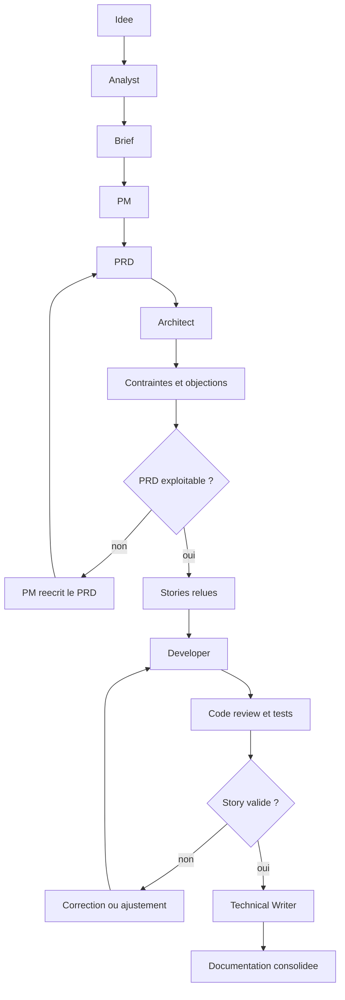

# Chapitre 5 · BMAD-METHOD : cadrer, challenger et livrer avec des agents

Quand on parle de **projet web**, on parle rarement d’un simple morceau de code isolé. Même sur un petit sujet, on peut vite être amené à travailler à plusieurs, à clarifier un besoin, à découper le travail, à arbitrer entre vitesse et qualité, puis à avancer par itérations.

C’est pour cela que la logique **agile** revient si souvent dans les équipes produit et techniques. L’idée de fond est assez simple : au lieu de partir dans tous les sens ou de vouloir tout définir d’un coup, on essaie de transformer une intention encore floue en éléments plus clairs, plus petits, plus discutables et plus testables.

**BMAD-METHOD** (*Breakthrough Method for Agile AI Driven Development*) reprend cette logique, mais l’étend au travail avec des agents IA. Il ne s’agit plus seulement de demander "écris-moi ce composant", mais d’installer dans le dépôt une **chaîne de rôles**, de **workflows** et d’**artefacts** pour passer d’une idée floue à un plan, puis à du code, puis à une revue, sans repartir de zéro à chaque session.

Autrement dit, BMAD essaie de répondre à une question très concrète : **comment faire travailler des agents IA comme une mini-équipe de produit et d’ingénierie, sans perdre le contrôle humain ?**

La documentation officielle est sur [docs.bmad-method.org](https://docs.bmad-method.org) et le dépôt source sur [github.com/bmad-code-org/BMAD-METHOD](https://github.com/bmad-code-org/BMAD-METHOD). Le tutoriel d’entrée utile pour commencer est [Getting Started](https://docs.bmad-method.org/tutorials/getting-started/), et la liste des agents évolue dans la [référence Agents](https://docs.bmad-method.org/reference/agents/).

> **En bref**
>
> BMAD ne "remplace" pas une équipe. Il outille une façon de travailler où les agents produisent des **documents intermédiaires**, se **challengent** via ces documents, puis aident à **implémenter** et **relire**. Le gain n’est pas seulement la vitesse de code. Le gain est la capacité à garder une trace exploitable du raisonnement produit, technique et qualité.

---

## 1. Ce que vous saurez faire après ce chapitre

À la fin de ce chapitre, vous devriez pouvoir :

1. **Expliquer** à quoi sert BMAD au-delà du simple "code généré par IA".
2. **Choisir** une piste raisonnable entre **Quick Flow**, **BMad Method** et un cadrage plus lourd.
3. **Faire circuler** une idée entre plusieurs agents sans perdre le contrôle humain ni le fil produit.
4. **Identifier** les artefacts à relire avant de passer à l’étape suivante.
5. **Piloter** une boucle d’itération par story, avec revue et tests, jusqu’à la fin d’un épic.

---

## 2. Ce que BMAD change vraiment

Sans cadre, beaucoup d’usages de l’IA finissent par ressembler au même scénario : on parle longtemps dans un chat, l’agent propose du code, on corrige à la main, puis deux jours plus tard personne ne sait plus très bien **pourquoi** cette solution a été choisie.

Avec BMAD, on change de niveau. Le dépôt ne sert plus seulement à stocker le code ; il sert aussi à stocker le **raisonnement de projet** : le besoin métier, les hypothèses, les arbitrages, les risques, l’architecture, les épics, les stories et le suivi de mise en oeuvre.

Le résultat attendu n’est donc pas juste "un agent plus malin". Le résultat attendu est une **chaîne de travail plus robuste**. Il faut le redire clairement : **BMAD n’est pas un catalogue d’agents. C’est une méthode de passage de relais entre artefacts, agents et validation humaine.**

### 2.1. Ce que cela permet en pratique

Bien utilisé, BMAD aide à partir d’une **simple idée** pour la transformer en **brief produit**, puis en **PRD**, puis en **architecture**, puis en **épics** et **stories** avec critères d’acceptation. Il guide ensuite l’implémentation story par story, facilite la **revue de code** et la génération de **tests E2E**, et laisse derrière lui une documentation qui permet à la session suivante de repartir de fichiers plutôt que d’un souvenir.

### 2.2. Jusqu’où cela peut aller

Le niveau "simple" consiste à accélérer un **POC** ou une **feature bien bornée**.

Le niveau "sérieux" consiste à faire travailler plusieurs angles de vue en parallèle dans le temps : un angle **produit** pour clarifier le besoin, un angle **architecture** pour refuser les solutions fragiles, un angle **développement** pour implémenter, un angle **review** pour chercher les écarts et un angle **documentation** pour consolider ce qui restera dans le dépôt.

Le niveau "avancé" consiste à faire dialoguer ces rôles **par artefacts interposés**. Ce point est essentiel : dans BMAD, les agents collaborent surtout via les fichiers générés et relus, pas parce qu’on les imagine "penser ensemble par magie" dans un même cerveau.

### 2.3. Ce que BMAD ne fait pas à votre place

BMAD ne retire pas les responsabilités humaines les plus importantes. C’est toujours à vous de décider ce qui a de la valeur métier, d’arbitrer entre vitesse, qualité, coût et dette, de refuser une spec floue, de valider une architecture engageante, de protéger les données et les secrets, puis de décider qu’un POC mérite ou non d’aller plus loin.

Dit autrement : BMAD aide à **formaliser**, **questionner**, **enchaîner** et **produire**. Il ne vous dispense jamais de **juger**.

---

## 3. Ce que l’installation ajoute au projet

Après `npx bmad-method install` et selon la version de la doc :

| Dossier | Rôle |
|---------|------|
| **`_bmad/`** | Configuration, agents, workflows, tâches : le **moteur** BMad dans le dépôt. |
| **`_bmad-output/`** | Artefacts générés : brief, PRD, architecture, épics, stories, suivi, etc. |

Les sous-dossiers exacts peuvent varier selon la version et les modules installés. Le bon réflexe reste simple : **ouvrir les fichiers générés chez vous** et comprendre leur rôle réel au lieu de mémoriser un schéma théorique.

**Versionnement** : si l’équipe veut partager la même façon de travailler, versionnez `_bmad/` et `_bmad-output/` comme le reste. Sinon, définissez explicitement ce qui reste local et ce qui fait foi dans Git.

---

## 4. Phases, pistes et ordre logique

La documentation BMAD présente un parcours en **quatre grandes phases** :

| Phase | Contenu typique |
|-------|------------------|
| **1 : Analyse** | Brainstorming, recherche, brief, PR/FAQ, clarification du problème. |
| **2 : Planification** | PRD, cadrage produit, priorisation, préparation du backlog. |
| **3 : Solutioning** | Architecture, décisions techniques, vérification de cohérence. |
| **4 : Implémentation** | Sprint, stories, code, revue, tests, rétrospective. |

La méthode propose ensuite plusieurs **pistes** :

| Piste | Quand l’utiliser | Sorties attendues |
|-------|------------------|-------------------|
| **Quick Flow** | Petit besoin, POC simple, bugfix, feature claire | Parcours plus court vers l’implémentation |
| **BMad Method** | Produit ou module avec plusieurs décisions à prendre | PRD, architecture, épics, stories |
| **Enterprise** | Environnement plus contraint : sécurité, conformité, exploitation, multi-équipes | Cadre plus lourd, plus de gouvernance |

Pour un **POC de 1 à 2 jours**, la piste **Quick Flow** ou un usage léger de la piste standard est souvent suffisante. Pour un sujet qui implique plusieurs choix structurants, aller trop vite au code est souvent une fausse économie.

### 4.1. Comment choisir la bonne piste

Si vous avez un besoin déjà très borné, peu de zones impactées et presque pas d’arbitrage produit, **Quick Flow** suffit souvent. Si vous avez plusieurs hypothèses métier, plusieurs choix techniques et un besoin de garder une trace propre des décisions, la piste **BMad Method** est plus adaptée. Et si vous êtes dans un contexte plus chargé en gouvernance, sécurité, conformité ou coordination, il faut accepter un cadre plus lourd.

Vous pouvez vous poser une question simple : **est-ce que je risque surtout de perdre du temps à coder, ou surtout de perdre du temps à mal cadrer ?** Si le vrai risque est le cadrage, il faut davantage d’artefacts avant de développer.

---

## 5. Les agents principaux et leur rôle réel

Les identifiants exacts dépendent de votre installation et de la version courante, mais la logique d’ensemble reste stable.

| Agent | Skill doc typique | À quoi il sert vraiment |
|-------|-------------------|-------------------------|
| **Analyst** | `bmad-analyst` | Explorer le problème, le contexte, les usages, les hypothèses, les alternatives. |
| **Product Manager** | `bmad-pm` | Transformer l’idée en besoin structuré : PRD, épics, stories, priorisation, réalignement. |
| **Architect** | `bmad-architect` | Tester la faisabilité, poser les choix techniques, détecter les angles morts. |
| **Developer** | `bmad-agent-dev` | Implémenter, planifier le sprint, produire les stories de dev, faire la revue de code, générer des tests E2E. |
| **UX Designer** | `bmad-ux-designer` | Structurer l’expérience et les flux d’interface. |
| **Technical Writer** | `bmad-tech-writer` | Produire ou consolider la documentation, les standards, les schémas. |

Un point important du noyau **BMM** par défaut : la **code review** et la **génération de tests E2E** passent par l’agent **Developer**, pas par un agent QA séparé dans la suite de base. Pour des besoins de test plus avancés, la documentation renvoie vers des modules complémentaires comme **TEA** (*Test Architect*).

---

## 6. Comment invoquer et interroger les agents

Le piège classique consiste à traiter BMAD comme un simple chatbot spécialisé. Or, la documentation officielle présente une mécanique plus cadrée. En pratique, BMAD propose surtout **deux façons de démarrer** : lancer directement un **skill**, ou charger un agent puis utiliser ses **menu triggers**.

Un **skill** lance immédiatement un agent, un workflow ou une tâche. Par exemple, `bmad-help`, `bmad-create-prd` ou `bmad-dev-story`. Un **agent menu trigger**, lui, ne s’utilise qu’une fois l’agent déjà chargé. On tape alors un code court comme `CP`, `CA` ou `DS`, et l’agent déclenche le workflow correspondant sans quitter sa session.

### 6.1. Les trois repères utiles dans la doc officielle

Trois pages de la documentation sont particulièrement utiles. La page [Skills](https://docs.bmad-method.org/reference/commands/) explique **comment lancer** un agent, un workflow ou une tâche. La page [Agents et trigger types](https://docs.bmad-method.org/reference/agents/) montre **quel agent sert à quoi**, avec ses codes de menu et la différence entre déclenchement de workflow et échange conversationnel. Enfin, la page [Getting Started](https://docs.bmad-method.org/tutorials/getting-started/) donne la **vue d’ensemble du parcours** : dans quel ordre avancer, quels artefacts sont produits et quand utiliser `bmad-help`.

### 6.2. Ce que la doc entend vraiment par "prompting"

Dans la doc BMAD, le prompting libre n’est pas la porte d’entrée principale. Le cas normal reste le **workflow structuré** : on lance un skill ou un trigger, puis l’agent suit les étapes prévues et vous demande les informations utiles au bon moment.

Le texte libre apparaît surtout dans trois cas :

1. avec **`bmad-help`**, qui accepte une question en langage naturel pour vous orienter ;
2. dans les **réponses que vous donnez pendant un workflow**, quand l’agent vous demande des précisions ;
3. dans certains **conversational triggers** documentés, surtout côté **Technical Writer**, où il faut fournir directement une description du besoin.

Autrement dit, BMAD n’est pas pensé d’abord comme "j’écris un grand prompt et on voit". Il est pensé comme une suite de **skills**, de **triggers** et d’**artefacts**.

> **Prudence**
>
> Si vous sortez trop du cadre et laissez l’agent produire des documents hors workflow, vous risquez surtout de **polluer le dépôt** avec des fichiers qui ne serviront pas dans la suite BMAD.

### 6.3. Ordre minimal

1. Lancez **`bmad-help`** si vous ne savez pas quelle est la prochaine étape logique.
2. Si vous savez déjà quoi faire, lancez directement le **skill** correspondant, par exemple **`bmad-create-prd`**, **`bmad-create-architecture`** ou **`bmad-dev-story`**.
3. Si vous êtes déjà dans une session d’agent, utilisez plutôt son **menu trigger** pour déclencher le bon workflow sans sortir du personnage.
4. Répondez aux questions du workflow et relisez le **fichier généré** avant d’enchaîner avec l’étape suivante.

Ce dernier point est central : dans BMAD, le vrai point de passage n’est pas le chat, c’est le **document généré**.

### 6.4. Exemples conformes à la doc

#### Lancer directement un workflow via un skill

- `bmad-create-prd`
- `bmad-create-architecture`
- `bmad-dev-story`

#### Déclencher un workflow depuis un agent déjà chargé

- `CP` pour **Create PRD**
- `CA` pour **Create Architecture**
- `DS` pour **Dev Story**

#### Poser une question à `bmad-help`

> "J’ai un PRD relu, une architecture encore incomplète et pas de stories. Quelle est la prochaine étape logique, et quels artefacts manquent pour que le développement ne parte pas de travers ?"

#### Exemple de trigger conversationnel documenté

La doc officielle cite surtout ce cas pour le **Technical Writer**. Par exemple :

- `WD Write a deployment guide for our Docker setup`
- `MG Create a sequence diagram showing the auth flow`
- `EC Explain how the module system works`

### 6.4.1. Mauvaise demande, meilleure demande

Une mauvaise demande BMAD ressemble souvent à : "fais-moi l’appli" ou "rédige les stories". C’est trop court, trop flou et cela pousse l’agent à inventer. Plus important encore : cela contourne la logique même de BMAD, qui prévoit déjà des **commandes de workflow** pour ces étapes.

Le meilleur réflexe consiste donc d’abord à lancer le bon workflow, par exemple **`bmad-create-prd`**. Ensuite seulement, si besoin, vous ajoutez une demande comme : "à partir de ce premier cadrage, rends visibles les hypothèses critiques, le hors périmètre et les critères d’acceptation minimum, puis liste les questions auxquelles il faut répondre avant de considérer le PRD comme exploitable."

Une mauvaise demande à l’Architect serait : "propose une architecture moderne". Là aussi, c’est trop vague, et cela contourne l’usage normal d’un workflow comme **`bmad-create-architecture`**.

Une meilleure demande complémentaire serait : "lis l’architecture produite, critique sa faisabilité, sépare ce qui est acceptable pour un POC, ce qui doit être traité proprement malgré tout, et ce qui doit être repoussé après validation."

### 6.5. Faire challenger explicitement l’agent

Beaucoup de sorties faibles viennent d’un défaut de consigne : on demande à l’agent de produire, mais jamais de **résister**. Quelques formulations simples marchent très bien :

- "cherche les objections les plus fortes" ;
- "liste ce qui ferait échouer ce POC" ;
- "si une hypothèse paraît fausse, dis-le franchement" ;
- "propose une version pessimiste et une version réaliste" ;
- "qu’est-ce qui semble élégant mais serait une mauvaise décision dans le temps ?".

Cette simple habitude change fortement la qualité des échanges.

---

## 7. Méthodes utiles pour l’agent Product Owner / Product Manager

Un bon agent PM n’est pas seulement un générateur de user stories. Il peut s’appuyer sur des **méthodes de cadrage reconnues** pour produire des documents plus solides.

Avant de rentrer dans chaque méthode, voici un guide simple :

| Si votre problème ressemble à... | Méthode la plus utile |
|----------------------------------|------------------------|
| L’idée est floue ou trop "solution d’abord" | **Lean Canvas** |
| Le besoin est mal formulé du point de vue utilisateur | **JTBD** |
| Le parcours est trop large et vous ne savez pas quoi garder pour le MVP | **Story Mapping** |
| Tout le monde dit que "tout est prioritaire" | **MoSCoW** ou **RICE** |
| Vous voulez savoir ce qu’il faut tester en premier dans le POC | **Riskiest Assumption Test** |
| Vous voulez raconter clairement la promesse et exposer les objections | **PRFAQ** |

### 7.1. Lean Canvas

Le **Lean Canvas** est utile au tout début parce qu’il force la clarté sur le problème, le segment d’utilisateurs, la proposition de valeur, les solutions possibles, les canaux, les coûts et les bénéfices attendus. C’est un très bon outil quand l’idée est encore trop vague ou trop pensée "solution d’abord".

### 7.2. JTBD (*Jobs To Be Done*)

Le JTBD aide à sortir du fantasme fonctionnel pour revenir à l’usage réel.

Exemple de question pour l’agent PM :

> "Au lieu de décrire des fonctionnalités, reformule le besoin en jobs to be done. Dans quelle situation l’utilisateur vient-il ? Qu’essaie-t-il vraiment d’obtenir ? Qu’est-ce qu’il remplace aujourd’hui ?"

Pour un POC, cela évite de construire une usine à gaz là où l’utilisateur veut juste un résultat simple et immédiat.

### 7.3. Story Mapping

Le **Story Mapping** est très utile pour distinguer le **parcours principal**, les cas secondaires, ce qui est nécessaire pour un **MVP** et ce qui peut attendre après validation. L’agent PM peut très bien produire une première carte textuelle du parcours avant même de détailler les stories.

### 7.4. MoSCoW ou RICE

Quand tout semble important, rien n’est priorisé. Des cadres comme **MoSCoW** (*Must, Should, Could, Won’t*) ou **RICE** (*Reach, Impact, Confidence, Effort*) aident l’agent PM à proposer un premier tri, à condition que vous relisiez ensuite ce tri avec un vrai regard métier.

### 7.5. Riskiest Assumption Test

Le **Riskiest Assumption Test** est très utile pour un POC, car il pose une question simple : quelle est l’hypothèse qui, si elle est fausse, rend le projet peu intéressant ? Dans notre exemple, cela peut être l’envie réelle d’un film "surprise", la qualité d’une API externe, le fait que l’expérience reste amusante après trois utilisations, ou encore le coût d’appel API. Un bon agent PM doit être capable d’identifier ces hypothèses et de proposer le **plus petit test crédible** pour les confronter.

### 7.6. PRFAQ

Le format **PRFAQ** (*Press Release + FAQ*) est utile quand vous voulez pousser l’agent à raconter le produit "comme s’il existait déjà", puis à répondre aux objections. C’est un bon outil pour clarifier la promesse, éviter le jargon interne, détecter les promesses non tenables et préparer une base de narration produit.

---

## 8. Faire dialoguer les agents entre eux

Le bon modèle n’est pas : "je mets cinq agents dans la même pièce virtuelle et ils vont inventer un chef-d’oeuvre".

Le bon modèle est plus sobre. Un agent produit un artefact, un autre le relit avec un autre angle, un humain arbitre, le document est mis à jour, puis l’agent suivant repart de cette version.

### 8.1. Chaîne de dialogue utile

Exemple simple : l’**Analyst** produit un brief à partir d’une idée, puis le **PM** transforme ce brief en PRD et en priorisation. L’**Architect** critique ensuite le PRD et remonte les contraintes, après quoi le **PM** le met à jour. Le **Developer** peut alors implémenter une story issue de cette version révisée, lancer une **code review**, puis le **Technical Writer** consolider la documentation finale si besoin.

Vu en schéma, cela ressemble souvent à une chaîne d’**artefacts relus** :

### 8.2. Formulation pratique

Vous pouvez demander explicitement à un agent de relire la sortie d’un autre :

> "Relis le PRD généré par le PM comme un architecte sceptique. Je veux les contradictions, les trous de faisabilité, les dépendances externes et les décisions qui n’ont pas encore été prises."

Puis :

> "Reprends les objections de l’architecte et mets à jour le PRD. Distingue ce qui est accepté, rejeté ou repoussé après le POC."

Cette boucle donne une sensation de "dialogue entre agents", mais elle reste **traçable**, parce qu’elle passe par des fichiers et des décisions visibles.

### 8.3. Se faire challenger soi-même

L’un des usages les plus intéressants est de retourner les agents contre vos propres idées.

Vous pouvez par exemple poser ce type de questions :

- au PM : "pourquoi ce besoin pourrait-il être artificiel ?" ;
- à l’architecte : "qu’est-ce que je suis en train de sur-construire ?" ;
- au développeur : "quelle partie paraît simple mais sera pénible à maintenir ?" ;
- au reviewer : "qu’est-ce qui manque pour considérer ce POC comme crédible ?".

Cela aide à ne pas tomber amoureux de la première idée séduisante.

---

## 9. Exemple avec un projet test

Prenons un exemple volontairement simple au départ :

> "Je veux une petite application qui me suggère un film au hasard quand je ne sais pas quoi regarder ce soir."

Le but n’est pas de faire compliqué. Le but est de vous montrer **comment** BMAD transforme une idée simple en une suite d’étapes lisibles, avec des documents que le prochain agent peut reprendre.

Si vous suivez cette formation en stage ou en autoformation, le bon réflexe est d’**essayer ce mini-POC chez vous**. Pas pour construire un grand produit, mais pour voir concrètement comment BMAD vous fait passer d’une idée vague à un cadrage, puis à une architecture, puis à des stories, puis à une petite implémentation relue.

### 9.1. Comment vous pouvez le faire chez vous

Sur cet exemple, votre déroulé peut ressembler à ceci :

1. **Analyse** : clarifiez le vrai besoin. Ici, le sujet n’est pas seulement "afficher un film au hasard", mais aider quelqu’un qui perd du temps à choisir.
2. **PRD** : laissez le PM cadrer le POC. L’objectif peut devenir : valider qu’un utilisateur obtient en quelques secondes une suggestion jugée utile ou amusante. Le hors périmètre exclut par exemple le compte utilisateur, la recommandation personnalisée et le paiement.
3. **Architecture** : demandez à l’Architect si le POC est faisable sans sur-ingénierie. Dans ce cas, une solution raisonnable serait : interface Next.js, appel simple à une API film, et fallback local si l’API tombe.
4. **Stories** : découpez le travail en petits blocs. Par exemple : obtenir une suggestion, relancer sans recharger la page, filtrer par genre, puis gérer un fallback local.
5. **Développement et revue** : laissez le Developer implémenter une story, puis relisez, testez et corrigez avant de passer à la suivante.

À chaque passage, on valide surtout un **artefact** : brief, PRD, architecture, stories, puis code et review.

### 9.2. Ce que vous devriez obtenir sur cet exemple

Si vous appliquez vraiment cette logique à ce projet test, vous devriez obtenir quelque chose comme :

- **Problème** : l’utilisateur hésite trop longtemps avant de choisir un film.
- **Promesse du POC** : proposer rapidement un film crédible, avec une interface simple à tester.
- **Architecture raisonnable** : une page, un bouton "Surprends-moi", un appel serveur simple, un fallback local et pas d’authentification.
- **Premières stories** : afficher une suggestion, relancer une autre proposition, filtrer par genre, gérer le cas où l’API externe échoue.

Si vous faites l’exercice sérieusement, vous verrez vite le bénéfice de BMAD : on ne part pas directement dans le code. On rend d’abord le sujet **plus clair**, **plus borné** et **plus testable**.

### 9.3. Objectif réaliste pour votre essai

En 1 à 2 jours, votre objectif n’est pas de sortir un "gros produit". L’objectif est plutôt d’obtenir :

- un **PRD** relu ;
- une **architecture** assez simple pour coder sans inventer ;
- quelques **stories** réalistes ;
- un premier parcours qui fonctionne ;
- une **review** et quelques **tests** ;
- une démo déjà **montrable**.

Le gain n’est pas seulement la vitesse. Le gain est d’avoir, dès ce petit essai, quelque chose de plus **propre**, **rejouable** et **réexploitable**.

---

## 10. Déroulé type dans BMAD

Une séquence simple et saine ressemble à cela : on commence par **`bmad-help`** pour situer la prochaine étape, puis on mobilise l’**Analyst** si le besoin est encore flou. Le **PM** produit ensuite le PRD, souvent via un workflow du type **`bmad-create-prd`**, avant que l’**Architect** ne travaille l’architecture ou la faisabilité, par exemple avec **`bmad-create-architecture`**. Le **PM** reprend alors le cadrage, génère les épics et stories, par exemple via **`bmad-create-epics-and-stories`**, puis le **Developer** enchaîne avec le sprint planning.

À partir de là, on entre dans une vraie boucle d’exécution. Pour chaque story, on ouvre un **nouvel agent** ou un **nouveau chat**, on développe, puis on ouvre un nouvel agent pour la review ou les tests, puis un autre si une correction est nécessaire. Le rythme réel ressemble donc souvent à **dev -> review/tests -> dev -> review/tests**, et non à une ligne droite. On répète cette mécanique story par story, puis épic par épic, jusqu’à la fin.

Un **Technical Writer** peut enfin consolider la documentation si c’est utile, mais seulement après ces itérations, quand le contenu s’est stabilisé.

Dans la documentation officielle, les noms précis de workflows peuvent changer avec les versions. L’enchaînement logique, lui, reste très stable.

### 10.1. Quand revenir en arrière ?

Revenir en arrière n’est pas un échec dans BMAD. C’est souvent le signe que la méthode fonctionne. Si l’**Architect** casse le PRD, il faut revenir au cadrage produit. Si une review montre qu’une story est mal bornée, il faut revenir à la story avant de recoder. Et si la démo du POC invalide l’hypothèse principale, il faut revenir au besoin, pas maquiller l’échec avec plus de développement.

Le pire réflexe consiste à continuer à coder pour "ne pas perdre le temps déjà passé". Dans ce type de méthode, on perd plus de temps à avancer sur une mauvaise base qu’à corriger l’artefact qui sert de base.

### 10.2. Quand un épic est-il terminé ?

Un épic n’est pas terminé parce que plusieurs commits existent ou parce qu’une démo "a l’air de marcher". Il est terminé quand ses stories utiles ont toutes passé la boucle de développement, de revue et de tests, quand les écarts restants sont explicitement repoussés, quand la documentation minimale a été remise à jour et quand l’équipe peut dire ce qui est livré, ce qui ne l’est pas encore et ce qui repart au backlog.

Autrement dit, la fin d’un épic est aussi un moment de rangement : on ferme ce qui est acceptable, on nomme ce qui reste ouvert et on évite de laisser des zones grises partout.

---

## 11. POC, évolution d’un existant, itérations

### 11.1. Pour un POC

Un POC correspond souvent à un cas **greenfield** : on part de presque rien, sur un sujet neuf ou très peu contraint.

Choisissez la voie la plus légère possible, mais pas plus légère que le risque.

Si le POC engage peu de choses, la piste **Quick Flow** est souvent suffisante. Si le POC comporte déjà plusieurs hypothèses produit et plusieurs décisions techniques, un minimum de PRD et d’architecture vous fera gagner du temps au lieu d’en perdre.

### 11.2. Pour un produit existant

Là, on est plutôt dans un cas **brownfield** : on ne construit pas sur une page blanche, on intervient sur un existant avec son code, ses choix passés, ses contraintes et parfois sa dette.

Installez BMAD **dans le dépôt concerné**, utilisez **`bmad-help`** pour identifier ce qui manque, puis complétez les artefacts déjà présents au lieu de régénérer tout à l’aveugle.

Le bon réflexe n’est pas "refaire tous les documents". Le bon réflexe est "mettre à jour la mémoire de projet là où elle est devenue fausse".

### 11.3. Pour itérer

Après un sprint, une démo ou un apprentissage terrain, relancez un workflow ciblé, ajustez le PRD ou les stories, utilisez un workflow de type **`bmad-correct-course`** si le périmètre dérive, puis conservez les artefacts comme source de vérité versionnée.

Il faut aussi accepter le **coût d’orchestration** de cette méthode. Ouvrir un nouvel agent, relire un fichier, refaire passer une story en review, relancer des tests ou corriger un artefact demande du temps. Mais ce temps est précisément ce qui évite de transformer un POC rapide en dette confuse deux jours plus tard.

---

## 12. Données sensibles et usage raisonnable

Les mêmes règles qu’au [chapitre 2](02-securite-ia.md) restent valables ici, avec une vigilance supplémentaire : BMAD incite à produire beaucoup de documents. Il faut donc éviter d’y injecter :

- des secrets ;
- des données personnelles non autorisées ;
- des informations contractuelles sensibles ;
- des éléments internes qui n’ont rien à faire dans le dépôt ou dans le chat.

Un PRD très riche mais bourré d’informations mal classées reste un mauvais PRD.

---

## 13. Erreurs fréquentes

Les erreurs fréquentes sont presque toujours les mêmes :

- traiter BMAD comme un simple générateur de fichiers au lieu d’un cadre de décision ;
- passer trop vite du brief au code sans faire challenger le besoin ;
- laisser l’agent combler les trous du métier sans les signaler ;
- oublier qu’un workflow réussi n’est jamais une validation produit ;
- croire que le "dialogue entre agents" remplace l’arbitrage humain ;
- mélanger plusieurs objectifs dans le même chat ;
- ne pas rouvrir un nouvel agent ou un nouveau chat entre deux étapes importantes ;
- négliger le hors périmètre, puis s’étonner que le POC dérive ;
- ne pas versionner les artefacts ;
- sauter la revue de code ou les tests parce que "le POC marche déjà".

---

## 14. Pour les PO / PM

BMAD est particulièrement intéressant pour vous si vous voulez sortir d’un fonctionnement où le besoin vit dans des tickets trop courts, des messages Slack ou des réunions non tracées.

Les trois réflexes les plus utiles sont :

- demander des **critères d’acceptation testables** ;
- faire expliciter les **hypothèses critiques** ;
- distinguer clairement **MVP**, **POC**, **suite logique** et **hors périmètre**.

Votre rôle n’est pas de laisser l’agent écrire "à votre place". Votre rôle est de l’utiliser pour mieux formuler le problème, mieux structurer le besoin, mieux faire apparaître les arbitrages et mieux préparer le travail des développeurs.

Il faut aussi accepter une réalité importante : **BMAD ne donne pas automatiquement un gain de temps**. Dans beaucoup d’équipes, certaines petites évolutions partaient autrefois presque directement en développement. Avec BMAD, on pousse davantage à **documenter**, à **relire**, à **challenger** et à **faire circuler des artefacts** avant de coder. Sur le moment, cela peut donner l’impression de ralentir.

Mais le bon angle n’est pas "est-ce qu’on tape moins de code en une heure ?". Le bon angle est plutôt : **est-ce qu’on travaille sur une base plus claire, plus transmissible et moins fragile ?** Le vrai gain de BMAD est souvent là : moins de décisions implicites, moins de contexte perdu, moins de recodage à cause d’un besoin mal compris, et une meilleure continuité entre produit, technique et exécution.

Il faut donc éviter deux fantasmes symétriques : croire que BMAD va tout accélérer par magie, ou croire qu’il va **remplacer les développeurs**. Ce n’est ni un bouton "productivité infinie", ni une machine à supprimer l’équipe. C’est un cadre de travail très puissant qui peut aider une équipe à mieux penser, mieux transmettre et mieux exécuter, à condition de rester piloté par des humains compétents.

Un bon PM avec BMAD ne demande donc pas seulement "rédige-moi des stories". Il demande aussi :

- ce que l’équipe essaie réellement de prouver ;
- quelle hypothèse doit être testée en premier ;
- ce qui serait inutilement ambitieux à ce stade ;
- ce qui manque pour qu’un développeur implémente sans inventer le métier.

> **Prudence**
>
> BMAD ne doit pas être introduit comme une initiative isolée dans un coin de l’organisation. Si un PO ou un PM installe seul la méthode, commence à produire des artefacts sans aligner les développeurs, sans expliquer le cadre et sans former l’équipe, le résultat risque d’être un **chaos coûteux** : documents qui ne font pas foi, stories mal reprises, doublons, incompréhensions, frustration et dette de coordination.
>
> Il faut toujours une **équipe derrière**, formée au minimum à l’outil, à ses limites et à son mode de fonctionnement. Plus l’outil est puissant, plus son mauvais usage peut coûter cher. BMAD peut apporter beaucoup de valeur, mais seulement si tout le monde comprend ce qui devient source de vérité, qui relit quoi, qui arbitre quoi et à quel moment on s’arrête pour corriger le cadre avant de continuer.

---

## 15. Marque et licence

**BMad** et **BMAD-METHOD** sont des marques de **BMad Code, LLC** ; le projet est publié sous **licence MIT**. Pour l’usage du nom et du logo, voir les fichiers de licence et de marque du dépôt officiel.

---

## 16. Checklist de fin de chapitre

- [ ] Je comprends que BMAD ne sert pas seulement à générer du code, mais à organiser une chaîne de travail avec artefacts versionnés  
- [ ] Je sais ce que contiennent **`_bmad/`** et **`_bmad-output/`** après installation  
- [ ] Je peux expliquer jusqu’où BMAD peut aller sur un POC ou un petit produit  
- [ ] Je sais interroger un agent pour clarifier, challenger, prioriser ou refuser un périmètre insuffisant  
- [ ] Je comprends comment faire dialoguer plusieurs agents via des documents relus, plutôt qu’en espérant une coordination implicite  
- [ ] Je peux mobiliser des méthodes comme **Lean Canvas**, **JTBD**, **Story Mapping**, **MoSCoW/RICE** ou **PRFAQ** pour mieux utiliser l’agent PM  
- [ ] Je sais reconnaître quand un **PRD** ou une **story** est assez bon pour passer à l’étape suivante  
- [ ] Je peux dérouler un cas simple comme le POC de suggestion de film depuis l’idée jusqu’à l’implémentation et la revue  
- [ ] Je comprends qu’un épic se termine après plusieurs boucles d’itération, pas après un seul passage de code  
- [ ] Je sais quand rester en **Quick Flow** et quand ajouter davantage de cadrage  
- [ ] Je sais où regarder dans la documentation officielle si un skill ou un workflow change de nom  

---

## 17. Mini-glossaire du chapitre 5

| Terme | Sens ici |
|-------|----------|
| **PO / PM** | **Product Owner** / **Product Manager** : rôles qui cadrent le besoin, priorisent et valident la valeur du travail. |
| **Workflow** | Séquence nommée dans BMAD qui guide une étape de travail et produit ou met à jour des fichiers. |
| **Skill** | Identifiant d’agent à invoquer, comme `bmad-pm` ou `bmad-agent-dev`, selon la version de votre installation. |
| **Artefact** | Fichier produit par la méthode : brief, PRD, architecture, story, suivi de sprint, etc. |
| **PRD** | *Product Requirements Document* : document qui structure le besoin produit avant le découpage détaillé. |
| **Epic / épic** | Grand bloc de travail ou objectif fonctionnel, ensuite découpé en plusieurs stories plus petites. |
| **Story / user story** | Petit besoin formulé du point de vue de l’utilisateur, normalement assez précis pour être développé et vérifié. |
| **Gate** | Point de contrôle avant de passer à l’étape suivante : on relit l’artefact et on décide s’il est assez bon pour continuer. |
| **Critères d’acceptation** | Conditions concrètes qui permettent de dire si une story est terminée correctement ou non. |
| **Backlog** | Liste priorisée des sujets à faire : features, stories, corrections, améliorations. |
| **Sprint** | Courte période de travail pendant laquelle l’équipe essaie de livrer un ensemble borné d’éléments. |
| **MVP** | *Minimum Viable Product* : version la plus petite d’un produit qui reste déjà utile ou testable. |
| **POC** | *Proof of Concept* : démonstration rapide destinée à vérifier qu’une idée ou une approche tient debout. |
| **Greenfield** | Projet ou chantier lancé presque depuis zéro, avec peu d’existant à reprendre. |
| **Brownfield** | Travail sur un produit ou un système déjà en place, avec un existant à comprendre et à respecter. |
| **Story Mapping** | Méthode de découpage du parcours utilisateur pour distinguer le coeur du MVP des compléments. |
| **JTBD** | *Jobs To Be Done* : manière de décrire le besoin par le travail réel que l’utilisateur cherche à accomplir. |
| **Lean Canvas** | Grille courte de cadrage produit pour clarifier problème, cible, valeur, solution et économie du projet. |
| **PRFAQ** | Format "communiqué de presse + FAQ" utilisé pour raconter le produit comme s’il existait déjà, puis tester la solidité de la promesse. |
| **Riskiest Assumption** | Hypothèse la plus dangereuse du projet, celle qu’un POC doit souvent tester en premier. |
| **`bmad-help`** | Aide BMAD pour proposer la prochaine étape logique selon l’état du projet. |

