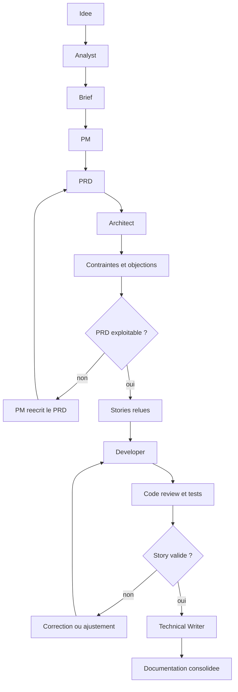

# Chapitre 5 · BMAD-METHOD : cadrer, challenger et livrer avec des agents

Un projet web dépasse vite le simple code : besoin à clarifier, arbitrages à poser, itérations à tenir. **BMAD-METHOD** applique cette logique au travail avec des agents IA : au lieu d’un long chat, on organise une chaîne de **rôles**, de **workflows** et d’**artefacts** pour passer d’une idée floue à des décisions relues, puis au code.

La question centrale est simple : **comment faire travailler des agents comme une mini-équipe sans perdre le contrôle humain ?** La documentation officielle reste la source de vérité : [docs.bmad-method.org](https://docs.bmad-method.org), dépôt [BMAD-METHOD](https://github.com/bmad-code-org/BMAD-METHOD), tutoriel [Getting Started](https://docs.bmad-method.org/tutorials/getting-started/) et [référence Agents](https://docs.bmad-method.org/reference/agents/).

---

## 1. Ce que vous saurez faire après ce chapitre

À la fin de ce chapitre, vous devriez pouvoir :

1. **Expliquer** à quoi sert BMAD au-delà du simple "code généré par IA".
2. **Choisir** une piste raisonnable entre **Quick Flow**, **BMad Method** et un cadrage plus lourd.
3. **Faire circuler** une idée entre plusieurs agents sans perdre le contrôle humain ni le fil produit.
4. **Identifier** les artefacts à relire avant de passer à l’étape suivante.
5. **Piloter** une boucle d’itération par story, avec revue et tests, jusqu’à la fin d’un épic.

---

## 2. Ce que BMAD change vraiment

Sans cadre, l’usage typique ressemble à ceci : long fil de chat, patchs de code, corrections à la main, et deux jours plus tard **personne ne sait plus** très bien **pourquoi** telle solution a été choisie.

Avec BMAD, le dépôt accueille aussi le **raisonnement de projet** — besoin, hypothèses, arbitrages, risques, architecture, épics, stories, suivi — pas seulement les lignes de code. L’objectif n’est pas « un agent plus malin », mais une **chaîne de travail plus robuste**. **BMAD n’est pas un catalogue d’agents** : c’est une méthode de **passage de relais** entre artefacts, agents et validation humaine.

### 2.1. Ce que cela permet en pratique

Bien utilisé, BMAD fait voyager une **idée** vers un **brief**, un **PRD**, une **architecture**, puis des **épics** et **stories** avec critères d’acceptation ; il accompagne l’implémentation pas à pas, la **revue** et les **tests E2E**, et laisse des **fichiers** sur lesquels la session suivante peut s’appuyer.

### 2.2. Jusqu’où cela peut aller

Du **POC** ou de la **feature bornée** au dispositif « sérieux » où **produit**, **architecture**, **dev**, **review** et **doc** travaillent en parallèle sur des angles différents. Au niveau avancé, ces rôles dialoguent **par artefacts** : dans BMAD, la collaboration passe par les documents relus, pas par l’illusion d’un « cerveau unique » partagé entre agents.

### 2.3. Ce que BMAD ne fait pas à votre place

Valeur métier, arbitrages vitesse / qualité / coût / dette, refus d’une spec floue, validation d’une architecture lourde, protection des **données** et des **secrets**, décision d’industrialiser ou non un POC : tout cela reste **humain**. BMAD aide à **formaliser**, **questionner**, **enchaîner** et **produire** ; il ne remplace pas le **jugement**.

---

## 3. Ce que l’installation ajoute au projet

Après `npx bmad-method install` et selon la version de la doc :

| Dossier | Rôle |
|---------|------|
| **`_bmad/`** | Configuration, agents, workflows, tâches : le **moteur** BMad dans le dépôt. |
| **`_bmad-output/`** | Artefacts générés : brief, PRD, architecture, épics, stories, suivi, etc. |

Les sous-dossiers exacts peuvent varier selon la version et les modules installés. Le bon réflexe reste simple : **ouvrir les fichiers générés chez vous** et comprendre leur rôle réel au lieu de mémoriser un schéma théorique.

**Versionnement** : si l’équipe veut partager la même façon de travailler, versionnez `_bmad/` et `_bmad-output/` comme le reste. Sinon, définissez explicitement ce qui reste local et ce qui fait foi dans Git.

---

## 4. Phases, pistes et ordre logique

La documentation BMAD présente un parcours en **quatre grandes phases** :

| Phase | Contenu typique |
|-------|------------------|
| **1 : Analyse** | Brainstorming, recherche, brief, PR/FAQ, clarification du problème. |
| **2 : Planification** | PRD, cadrage produit, priorisation, préparation du backlog. |
| **3 : Solutioning** | Architecture, décisions techniques, vérification de cohérence. |
| **4 : Implémentation** | Sprint, stories, code, revue, tests, rétrospective. |

La méthode propose ensuite plusieurs **pistes** :

| Piste | Quand l’utiliser | Sorties attendues |
|-------|------------------|-------------------|
| **Quick Flow** | Petit besoin, POC simple, bugfix, feature claire | Parcours plus court vers l’implémentation |
| **BMad Method** | Produit ou module avec plusieurs décisions à prendre | PRD, architecture, épics, stories |
| **Enterprise** | Environnement plus contraint : sécurité, conformité, exploitation, multi-équipes | Cadre plus lourd, plus de gouvernance |

Pour un **POC de 1 à 2 jours**, la piste **Quick Flow** ou un usage léger de la piste standard est souvent suffisante. Pour un sujet qui implique plusieurs choix structurants, aller trop vite au code est souvent une fausse économie.

### 4.1. Comment choisir la bonne piste

Si vous avez un besoin déjà très borné, peu de zones impactées et presque pas d’arbitrage produit, **Quick Flow** suffit souvent. Si vous avez plusieurs hypothèses métier, plusieurs choix techniques et un besoin de garder une trace propre des décisions, la piste **BMad Method** est plus adaptée. Et si vous êtes dans un contexte plus chargé en gouvernance, sécurité, conformité ou coordination, il faut accepter un cadre plus lourd.

Vous pouvez vous poser une question simple : **est-ce que je risque surtout de perdre du temps à coder, ou surtout de perdre du temps à mal cadrer ?** Si le vrai risque est le cadrage, il faut davantage d’artefacts avant de développer.

---

## 5. Les agents principaux et leur rôle réel

Les identifiants exacts dépendent de votre installation et de la version courante, mais la logique d’ensemble reste stable.

| Agent | Skill doc typique | À quoi il sert vraiment |
|-------|-------------------|-------------------------|
| **Analyst** | `bmad-analyst` | Explorer le problème, le contexte, les usages, les hypothèses, les alternatives. |
| **Product Manager** | `bmad-pm` | Transformer l’idée en besoin structuré : PRD, épics, stories, priorisation, réalignement. |
| **Architect** | `bmad-architect` | Tester la faisabilité, poser les choix techniques, détecter les angles morts. |
| **Developer** | `bmad-agent-dev` | Implémenter, planifier le sprint, produire les stories de dev, faire la revue de code, générer des tests E2E. |
| **UX Designer** | `bmad-ux-designer` | Structurer l’expérience et les flux d’interface. |
| **Technical Writer** | `bmad-tech-writer` | Produire ou consolider la documentation, les standards, les schémas. |

Un point important du noyau **BMM** par défaut : la **code review** et la **génération de tests E2E** passent par l’agent **Developer**, pas par un agent QA séparé dans la suite de base. Pour des besoins de test plus avancés, la documentation renvoie vers des modules complémentaires comme **TEA** (*Test Architect*).

---

## 6. Comment invoquer et interroger les agents

Éviter le piège « chatbot » : la doc officielle décrit une mécanique **cadrée**. En pratique, **deux entrées** : lancer un **skill** (`bmad-help`, `bmad-create-prd`, `bmad-dev-story`…) ou charger un agent puis ses **menu triggers** (`CP`, `CA`, `DS`… une fois l’agent actif).

### 6.1. Les trois repères utiles dans la doc officielle

Trois pages de la documentation sont particulièrement utiles. La page [Skills](https://docs.bmad-method.org/reference/commands/) explique **comment lancer** un agent, un workflow ou une tâche. La page [Agents et trigger types](https://docs.bmad-method.org/reference/agents/) montre **quel agent sert à quoi**, avec ses codes de menu et la différence entre déclenchement de workflow et échange conversationnel. Enfin, la page [Getting Started](https://docs.bmad-method.org/tutorials/getting-started/) donne la **vue d’ensemble du parcours** : dans quel ordre avancer, quels artefacts sont produits et quand utiliser `bmad-help`.

### 6.2. Ce que la doc entend vraiment par "prompting"

Le cas normal est le **workflow structuré** (skill ou trigger, puis étapes). Le texte libre sert surtout à :

1. **`bmad-help`** (question en langage naturel) ;
2. **vos réponses** quand le workflow demande des précisions ;
3. certains **triggers conversationnels** (ex. **Technical Writer**), avec une description directe du besoin.

BMAD = **skills**, **triggers**, **artefacts** — pas « un gros prompt et on verra ».

> **Prudence**
>
> Si vous sortez trop du cadre et laissez l’agent produire des documents hors workflow, vous risquez surtout de **polluer le dépôt** avec des fichiers qui ne serviront pas dans la suite BMAD.

### 6.3. Ordre minimal

1. Lancez **`bmad-help`** si vous ne savez pas quelle est la prochaine étape logique.
2. Si vous savez déjà quoi faire, lancez directement le **skill** correspondant, par exemple **`bmad-create-prd`**, **`bmad-create-architecture`** ou **`bmad-dev-story`**.
3. Si vous êtes déjà dans une session d’agent, utilisez plutôt son **menu trigger** pour déclencher le bon workflow sans sortir du personnage.
4. Répondez aux questions du workflow et relisez le **fichier généré** avant d’enchaîner avec l’étape suivante.

Ce dernier point est central : dans BMAD, le vrai point de passage n’est pas le chat, c’est le **document généré**.

### 6.4. Exemples conformes à la doc

#### Lancer directement un workflow via un skill

- `bmad-create-prd`
- `bmad-create-architecture`
- `bmad-dev-story`

#### Déclencher un workflow depuis un agent déjà chargé

- `CP` pour **Create PRD**
- `CA` pour **Create Architecture**
- `DS` pour **Dev Story**

#### Poser une question à `bmad-help`

> "J’ai un PRD relu, une architecture encore incomplète et pas de stories. Quelle est la prochaine étape logique, et quels artefacts manquent pour que le développement ne parte pas de travers ?"

#### Exemple de trigger conversationnel documenté

La doc officielle cite surtout ce cas pour le **Technical Writer**. Par exemple :

- `WD Write a deployment guide for our Docker setup`
- `MG Create a sequence diagram showing the auth flow`
- `EC Explain how the module system works`

### 6.4.1. Mauvaise demande, meilleure demande

« Fais-moi l’appli » / « rédige les stories » : **flou**, invention, et **contournement** des workflows prévus.

- Bon réflexe : **`bmad-create-prd`**, puis si besoin préciser hypothèses, hors périmètre, critères d’acceptation min., questions bloquantes.
- Côté architecte : éviter « architecture moderne » sans contexte ; partir de **`bmad-create-architecture`**, puis demander une **critique** (POC vs durable vs à repousser).

### 6.5. Faire challenger explicitement l’agent

Demander de **produire** sans demander de **résister** donne des sorties molles. Exemples : objections fortes ; échecs du POC ; hypothèses fausses dites clairement ; scénario pessimiste vs réaliste ; idées élégantes mais toxiques long terme.

---

## 7. Méthodes utiles pour l’agent Product Owner / Product Manager

Au-delà des user stories, l’agent PM gagne à s’appuyer sur des **méthodes de cadrage** reconnues. Guide rapide :

| Si votre problème ressemble à... | Méthode la plus utile |
|----------------------------------|------------------------|
| L’idée est floue ou trop "solution d’abord" | **Lean Canvas** |
| Le besoin est mal formulé du point de vue utilisateur | **JTBD** |
| Le parcours est trop large et vous ne savez pas quoi garder pour le MVP | **Story Mapping** |
| Tout le monde dit que "tout est prioritaire" | **MoSCoW** ou **RICE** |
| Vous voulez savoir ce qu’il faut tester en premier dans le POC | **Riskiest Assumption Test** |
| Vous voulez raconter clairement la promesse et exposer les objections | **PRFAQ** |

### 7.1. Lean Canvas

**Lean Canvas** : problème, segment, valeur, solutions, canaux, coûts, revenus — idéal quand l’idée est vague ou trop « solution d’abord ».

### 7.2. JTBD (*Jobs To Be Done*)

Sortir du fantasme fonctionnel : situation, résultat cherché, substitut actuel. Exemple pour l’agent :

> "Au lieu de décrire des fonctionnalités, reformule le besoin en jobs to be done. Dans quelle situation l’utilisateur vient-il ? Qu’essaie-t-il vraiment d’obtenir ? Qu’est-ce qu’il remplace aujourd’hui ?"

Utile en POC pour ne pas sur-construire.

### 7.3. Story Mapping

**Story Mapping** : parcours principal, cas secondaires, **MVP** vs plus tard — souvent une **carte textuelle** du parcours avant le détail des stories.

### 7.4. MoSCoW ou RICE

Si tout est prioritaire, rien ne l’est. **MoSCoW** ou **RICE** : premier tri proposé par l’agent, **à relire** avec le métier.

### 7.5. Riskiest Assumption Test

**Quelle hypothèse, si fausse, tue l’intérêt du POC ?** (besoin réel, API, lassitude, coût…). L’agent doit nommer ces hypothèses et le **plus petit test crédible** pour les confronter.

### 7.6. PRFAQ

Le **PRFAQ** invite à raconter le produit **comme s’il existait déjà**, puis à répondre aux objections : promesse lisible, jargon limité, promesses réalistes, bon socle pour la narration produit.

---

## 8. Faire dialoguer les agents entre eux

Inutile d’espérer cinq agents dans le même chat qui « inventent » quelque chose de cohérent. Le schéma sain, c’est plutôt : un **artefact**, une **relecture** sous un autre angle, un **arbitrage** humain, une **mise à jour** du document, puis l’**étape suivante** — toujours en s’appuyant sur ce qui est écrit.

### 8.1. Chaîne de dialogue utile

En résumé : l’**Analyst** produit un **brief**, le **PM** en fait un **PRD**, l’**Architect** remonte **contraintes** et objections, le **PM** met le PRD à jour, le **Developer** prend une **story** puis une **code review**, et le **Technical Writer** intervient si besoin. L’important est la chaîne d’**artefacts relus**, pas le nombre d’agents dans la pièce.

### 8.2. Formulation pratique

Relire explicitement la sortie d’un autre rôle, par exemple :

> "Relis le PRD généré par le PM comme un architecte sceptique. Je veux les contradictions, les trous de faisabilité, les dépendances externes et les décisions qui n’ont pas encore été prises."

Puis :

> "Reprends les objections de l’architecte et mets à jour le PRD. Distingue ce qui est accepté, rejeté ou repoussé après le POC."

**Traçable** : fichiers et décisions visibles, pas seulement le chat.

### 8.3. Se faire challenger soi-même

Vous pouvez aussi retourner les rôles contre **vos** propres idées : demander au PM si le besoin est artificiel, à l’architecte ce que vous sur-construisez, au développeur ce qui semble simple mais pénible à maintenir, au reviewer ce qui manque pour croire au POC.

---

## 9. Exemple avec un projet test

Exemple simple :

> "Je veux une petite application qui me suggère un film au hasard quand je ne sais pas quoi regarder ce soir."

L’objectif est de voir **comment** BMAD fait passer une idée en **artefacts** suffisamment clairs pour que le prochain agent reprenne le fil. En stage ou en autonomie, **refaire ce mini-POC** vous en dira plus long qu’un long discours.

### 9.1. Comment vous pouvez le faire chez vous

1. **Analyse** : besoin = gagner du temps à choisir, pas seulement « tirer un titre au hasard ».
2. **PRD** : suggestion rapide utile ou amusante ; hors scope : compte, reco avancée, paiement.
3. **Architecture** : faisable sans sur-ingénierie — ex. UI Next.js, API films, fallback local.
4. **Stories** : suggestion, relance sans reload, genre, fallback API.
5. **Dev + revue** : une story à la fois, relire et tester avant la suivante.

À chaque étape : un **artefact** validé (brief, PRD, archi, stories, code).

### 9.2. Ce que vous devriez obtenir sur cet exemple

- **Problème** : hésitation trop longue.
- **POC** : suggestion rapide, UI simple.
- **Archi** : page, « Surprends-moi », appel serveur, fallback, sans auth.
- **Stories** : suggestion, relance, genre, panne API.

Intérêt : **clarifier et borner** avant le code.

### 9.3. Objectif réaliste pour votre essai

En 1–2 jours : viser PRD relu, archi simple, quelques stories, un parcours qui tourne, review + tests, démo montrable — pas un « gros produit ». Gain : base **propre** et **réexploisable**.

---

## 10. Déroulé type dans BMAD

Une séquence simple et saine ressemble à cela : on commence par **`bmad-help`** pour situer la prochaine étape, puis on mobilise l’**Analyst** si le besoin est encore flou. Le **PM** produit ensuite le PRD, souvent via un workflow du type **`bmad-create-prd`**, avant que l’**Architect** ne travaille l’architecture ou la faisabilité, par exemple avec **`bmad-create-architecture`**. Le **PM** reprend alors le cadrage, génère les épics et stories, par exemple via **`bmad-create-epics-and-stories`**, puis le **Developer** enchaîne avec le sprint planning.

À partir de là, on entre dans une vraie boucle d’exécution. Pour chaque story, on ouvre un **nouvel agent** ou un **nouveau chat**, on développe, puis on ouvre un nouvel agent pour la review ou les tests, puis un autre si une correction est nécessaire. Le rythme réel ressemble donc souvent à **dev -> review/tests -> dev -> review/tests**, et non à une ligne droite. On répète cette mécanique story par story, puis épic par épic, jusqu’à la fin.

Un **Technical Writer** peut enfin consolider la documentation si c’est utile, mais seulement après ces itérations, quand le contenu s’est stabilisé.

Dans la documentation officielle, les noms précis de workflows peuvent changer avec les versions. L’enchaînement logique, lui, reste très stable.

### 10.1. Quand revenir en arrière ?

Revenir en arrière n’est pas un échec dans BMAD. C’est souvent le signe que la méthode fonctionne. Si l’**Architect** casse le PRD, il faut revenir au cadrage produit. Si une review montre qu’une story est mal bornée, il faut revenir à la story avant de recoder. Et si la démo du POC invalide l’hypothèse principale, il faut revenir au besoin, pas maquiller l’échec avec plus de développement.

Le pire réflexe consiste à continuer à coder pour "ne pas perdre le temps déjà passé". Dans ce type de méthode, on perd plus de temps à avancer sur une mauvaise base qu’à corriger l’artefact qui sert de base.

### 10.2. Quand un épic est-il terminé ?

Un épic n’est pas terminé parce que plusieurs commits existent ou parce qu’une démo "a l’air de marcher". Il est terminé quand ses stories utiles ont toutes passé la boucle de développement, de revue et de tests, quand les écarts restants sont explicitement repoussés, quand la documentation minimale a été remise à jour et quand l’équipe peut dire ce qui est livré, ce qui ne l’est pas encore et ce qui repart au backlog.

Autrement dit, la fin d’un épic est aussi un moment de rangement : on ferme ce qui est acceptable, on nomme ce qui reste ouvert et on évite de laisser des zones grises partout.

---

## 11. POC, évolution d’un existant, itérations

### 11.1. Pour un POC

Un POC correspond souvent à un cas **greenfield** : on part de presque rien, sur un sujet neuf ou très peu contraint.

Choisissez la voie la plus légère possible, mais pas plus légère que le risque.

Si le POC engage peu de choses, la piste **Quick Flow** est souvent suffisante. Si le POC comporte déjà plusieurs hypothèses produit et plusieurs décisions techniques, un minimum de PRD et d’architecture vous fera gagner du temps au lieu d’en perdre.

### 11.2. Pour un produit existant

Là, on est plutôt dans un cas **brownfield** : on ne construit pas sur une page blanche, on intervient sur un existant avec son code, ses choix passés, ses contraintes et parfois sa dette.

Installez BMAD **dans le dépôt concerné**, utilisez **`bmad-help`** pour identifier ce qui manque, puis complétez les artefacts déjà présents au lieu de régénérer tout à l’aveugle.

Le bon réflexe n’est pas "refaire tous les documents". Le bon réflexe est "mettre à jour la mémoire de projet là où elle est devenue fausse".

### 11.3. Pour itérer

Après un sprint, une démo ou un apprentissage terrain, relancez un workflow ciblé, ajustez le PRD ou les stories, utilisez un workflow de type **`bmad-correct-course`** si le périmètre dérive, puis conservez les artefacts comme source de vérité versionnée.

Il faut aussi accepter le **coût d’orchestration** de cette méthode. Ouvrir un nouvel agent, relire un fichier, refaire passer une story en review, relancer des tests ou corriger un artefact demande du temps. Mais ce temps est précisément ce qui évite de transformer un POC rapide en dette confuse deux jours plus tard.

---

## 12. Données sensibles et usage raisonnable

Les mêmes règles qu’en **sécurité** restent valables ici, avec une vigilance supplémentaire : BMAD incite à produire beaucoup de documents. Il faut donc éviter d’y injecter :

- des secrets ;
- des données personnelles non autorisées ;
- des informations contractuelles sensibles ;
- des éléments internes qui n’ont rien à faire dans le dépôt ou dans le chat.

Un PRD très riche mais bourré d’informations mal classées reste un mauvais PRD.

---

## 13. Erreurs fréquentes

Les erreurs fréquentes sont presque toujours les mêmes :

- traiter BMAD comme un simple générateur de fichiers au lieu d’un cadre de décision ;
- passer trop vite du brief au code sans faire challenger le besoin ;
- laisser l’agent combler les trous du métier sans les signaler ;
- oublier qu’un workflow réussi n’est jamais une validation produit ;
- croire que le "dialogue entre agents" remplace l’arbitrage humain ;
- mélanger plusieurs objectifs dans le même chat ;
- ne pas rouvrir un nouvel agent ou un nouveau chat entre deux étapes importantes ;
- négliger le hors périmètre, puis s’étonner que le POC dérive ;
- ne pas versionner les artefacts ;
- sauter la revue de code ou les tests parce que "le POC marche déjà".

---

## 14. Pour les PO / PM

BMAD est particulièrement intéressant pour vous si vous voulez sortir d’un fonctionnement où le besoin vit dans des tickets trop courts, des messages Slack ou des réunions non tracées.

Les trois réflexes les plus utiles sont :

- demander des **critères d’acceptation testables** ;
- faire expliciter les **hypothèses critiques** ;
- distinguer clairement **MVP**, **POC**, **suite logique** et **hors périmètre**.

Vous n’utilisez pas l’agent pour qu’il **pense à votre place**, mais pour **cadrer** le problème, le besoin, les arbitrages et le handoff dev.

**BMAD n’accélère pas tout seul** : plus de doc et d’artefacts avant le code — parfois plus lent tout de suite, mais **base plus claire, transmissible, moins fragile** (moins d’implicite, moins de recodage pour mauvaise compréhension). Ni baguette magique, ni remplacement des devs : cadre **piloté par l’humain**. Au-delà de « rédige des stories » : que **prouver**, quelle **hypothèse** en premier, quoi d’**inutilement ambitieux**, qu’est-ce qui évite que le dev **invente le métier** ?

> **Prudence**
>
> BMAD ne doit pas être introduit comme une initiative isolée dans un coin de l’organisation. Si un PO ou un PM installe seul la méthode, commence à produire des artefacts sans aligner les développeurs, sans expliquer le cadre et sans former l’équipe, le résultat risque d’être un **chaos coûteux** : documents qui ne font pas foi, stories mal reprises, doublons, incompréhensions, frustration et dette de coordination.
>
> Il faut toujours une **équipe derrière**, formée au minimum à l’outil, à ses limites et à son mode de fonctionnement. Plus l’outil est puissant, plus son mauvais usage peut coûter cher. BMAD peut apporter beaucoup de valeur, mais seulement si tout le monde comprend ce qui devient source de vérité, qui relit quoi, qui arbitre quoi et à quel moment on s’arrête pour corriger le cadre avant de continuer.

---

## 15. Marque et licence

**BMad** et **BMAD-METHOD** sont des marques de **BMad Code, LLC** ; le projet est publié sous **licence MIT**. Pour l’usage du nom et du logo, voir les fichiers de licence et de marque du dépôt officiel.

---

## 16. Checklist de fin de chapitre

- [ ] Je comprends que BMAD ne sert pas seulement à générer du code, mais à organiser une chaîne de travail avec artefacts versionnés  
- [ ] Je sais ce que contiennent **`_bmad/`** et **`_bmad-output/`** après installation  
- [ ] Je peux expliquer jusqu’où BMAD peut aller sur un POC ou un petit produit  
- [ ] Je sais interroger un agent pour clarifier, challenger, prioriser ou refuser un périmètre insuffisant  
- [ ] Je comprends comment faire dialoguer plusieurs agents via des documents relus, plutôt qu’en espérant une coordination implicite  
- [ ] Je peux mobiliser des méthodes comme **Lean Canvas**, **JTBD**, **Story Mapping**, **MoSCoW/RICE** ou **PRFAQ** pour mieux utiliser l’agent PM  
- [ ] Je sais reconnaître quand un **PRD** ou une **story** est assez bon pour passer à l’étape suivante  
- [ ] Je peux dérouler un cas simple comme le POC de suggestion de film depuis l’idée jusqu’à l’implémentation et la revue  
- [ ] Je comprends qu’un épic se termine après plusieurs boucles d’itération, pas après un seul passage de code  
- [ ] Je sais quand rester en **Quick Flow** et quand ajouter davantage de cadrage  
- [ ] Je sais où regarder dans la documentation officielle si un skill ou un workflow change de nom  

---

## 17. Mini-glossaire du chapitre 5

| Terme | Sens ici |
|-------|----------|
| **PO / PM** | **Product Owner** / **Product Manager** : rôles qui cadrent le besoin, priorisent et valident la valeur du travail. |
| **Workflow** | Séquence nommée dans BMAD qui guide une étape de travail et produit ou met à jour des fichiers. |
| **Skill** | Identifiant d’agent à invoquer, comme `bmad-pm` ou `bmad-agent-dev`, selon la version de votre installation. |
| **Artefact** | Fichier produit par la méthode : brief, PRD, architecture, story, suivi de sprint, etc. |
| **PRD** | *Product Requirements Document* : document qui structure le besoin produit avant le découpage détaillé. |
| **Epic / épic** | Grand bloc de travail ou objectif fonctionnel, ensuite découpé en plusieurs stories plus petites. |
| **Story / user story** | Petit besoin formulé du point de vue de l’utilisateur, normalement assez précis pour être développé et vérifié. |
| **Gate** | Point de contrôle avant de passer à l’étape suivante : on relit l’artefact et on décide s’il est assez bon pour continuer. |
| **Critères d’acceptation** | Conditions concrètes qui permettent de dire si une story est terminée correctement ou non. |
| **Backlog** | Liste priorisée des sujets à faire : features, stories, corrections, améliorations. |
| **Sprint** | Courte période de travail pendant laquelle l’équipe essaie de livrer un ensemble borné d’éléments. |
| **MVP** | *Minimum Viable Product* : version la plus petite d’un produit qui reste déjà utile ou testable. |
| **POC** | *Proof of Concept* : démonstration rapide destinée à vérifier qu’une idée ou une approche tient debout. |
| **Greenfield** | Projet ou chantier lancé presque depuis zéro, avec peu d’existant à reprendre. |
| **Brownfield** | Travail sur un produit ou un système déjà en place, avec un existant à comprendre et à respecter. |
| **Story Mapping** | Méthode de découpage du parcours utilisateur pour distinguer le coeur du MVP des compléments. |
| **JTBD** | *Jobs To Be Done* : manière de décrire le besoin par le travail réel que l’utilisateur cherche à accomplir. |
| **Lean Canvas** | Grille courte de cadrage produit pour clarifier problème, cible, valeur, solution et économie du projet. |
| **PRFAQ** | Format "communiqué de presse + FAQ" utilisé pour raconter le produit comme s’il existait déjà, puis tester la solidité de la promesse. |
| **Riskiest Assumption** | Hypothèse la plus dangereuse du projet, celle qu’un POC doit souvent tester en premier. |
| **`bmad-help`** | Aide BMAD pour proposer la prochaine étape logique selon l’état du projet. |

