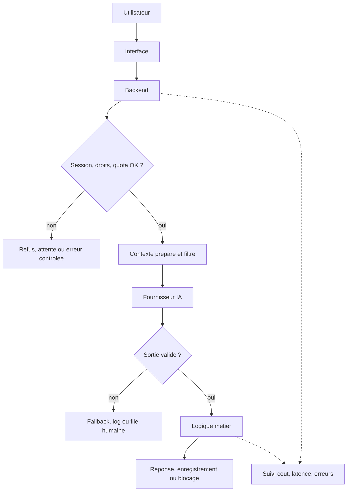
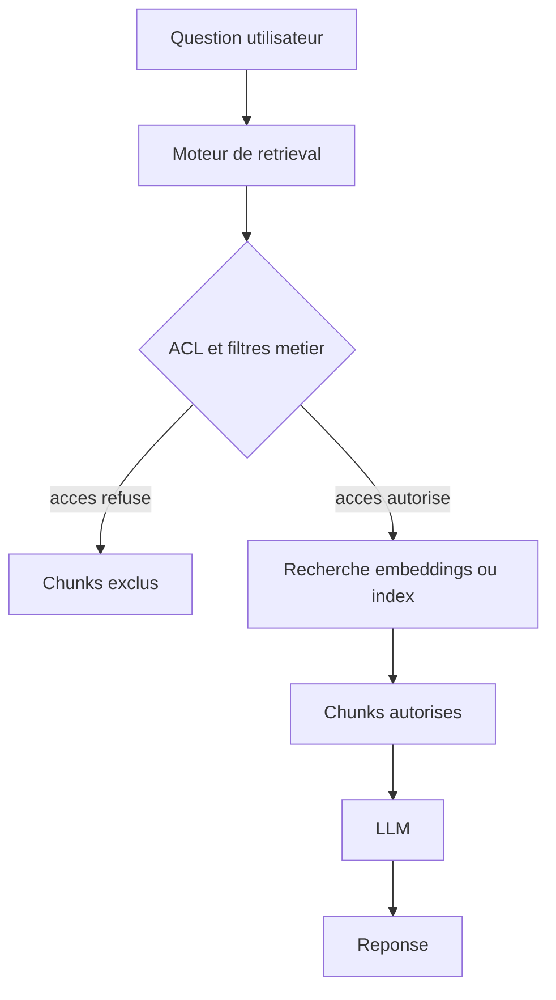

# Chapitre 6 · Produit augmenté par l’IA : chat, APIs et intégration

Ici, on passe de l’usage de l’IA dans le travail à l’**intégration dans un vrai produit**. L’enjeu n’est pas seulement de « faire parler un modèle », mais de tenir un flux propre : **backend**, **quotas**, **validation**, **coût**, **latence** et parfois **conformité**.

Les APIs et les prix changent vite : gardez les principes, revalidez les détails dans la doc officielle. Et dans un produit sérieux, le navigateur parle à **votre backend**, pas directement au LLM : c’est votre code qui filtre, borne et décide.

---

## 1. Ce que vous saurez faire après ce chapitre

À la fin de ces pages, vous devriez pouvoir :

1. **Tracer un flux IA minimal** sans exposer les secrets.
2. **Distinguer** chat, extraction structurée et modération.
3. **Brancher proprement** l’IA dans `Next.js` via des routes serveur.
4. **Raisonner en coût** (tokens, quotas, limites).
5. **Choisir l’outillage adapté** : API cloud, `n8n`, worker, petit RAG, auto-hébergement.

---

## 2. Le schéma minimal qui tient la route

Le schéma minimal est simple ; ce qui change avec l’IA, ce sont surtout les **risques** et la **variabilité** des réponses.

Vous pouvez aussi le visualiser comme ceci :



1. **L’utilisateur** déclenche une action depuis l’interface : message, commentaire, recherche, import de texte, demande de résumé.
2. **Votre serveur** reçoit la requête, retrouve la session, applique les droits et vérifie que l’utilisateur a le droit d’utiliser cette feature.
3. **Votre code** prépare un contexte contrôlé : prompt système, morceaux d’historique, données internes déjà autorisées, résultats d’APIs externes, ou texte nettoyé.
4. **Le fournisseur IA** renvoie soit du texte, soit un objet structuré.
5. **Votre code** valide la sortie, applique la logique métier, journalise les métriques utiles, puis seulement ensuite affiche, enregistre, bloque ou met en file humaine.

Ce schéma paraît presque trop simple. Pourtant, beaucoup d’erreurs viennent du fait qu’on saute l’une de ces étapes. On laisse le front appeler directement le modèle. On oublie de valider le JSON. On envoie trop de contexte. On n’a pas de quota. On n’a pas de plan B si le fournisseur est lent ou en panne.

Dans un produit un peu sérieux, il faut aussi penser à trois couches supplémentaires, même si on ne les dessine pas toujours sur le premier schéma : la **mesure** des coûts, la **gestion des erreurs** et la **dégradation gracieuse**. Une feature IA peut très bien répondre *"service temporairement indisponible"* ou *"votre contenu est en revue"* au lieu de faire semblant que tout va bien.

**Ce qu’il ne faut pas faire** : mettre la clé API dans le JavaScript du navigateur, dans une application mobile non durcie, ou dans un script embarqué côté client. Si la clé vit là, elle finira tôt ou tard par être copiée, abusée ou revendue.

**Ce que "brancher une API IA" veut dire concrètement** : en pratique, votre backend effectue une requête `POST` avec un corps JSON, souvent de la forme `model + messages + options`, ou bien utilise un SDK qui encapsule exactement la même mécanique. Le détail de l’URL change. Le principe, lui, ne change presque pas.

---

## 3. Trois patterns typiques pour augmenter une app

Avant de regarder des projets `Next.js`, il faut garder trois patterns en tête. Ce sont eux qui évitent de tout mélanger.

### 3.1. Pattern 1 : chat ou assistant dans le produit

Ici, l’utilisateur dialogue avec une interface qui garde une mémoire courte ou longue selon le besoin. Le modèle sert à **rédiger une réponse utile**, parfois avec des instructions métier, parfois avec un peu de contexte documentaire. Le risque principal n’est pas seulement la qualité de la réponse : c’est aussi la **taille de l’historique**, donc le **coût** et la **latence**.

Le chat est séduisant parce qu’il semble simple à brancher. En réalité, c’est souvent le pattern le plus trompeur, car on a vite envie d’y injecter trop de choses : l’historique complet, des documents internes, des résultats d’API, des préférences utilisateur, des règles métier, puis encore d’autres outils. C’est ainsi que les tokens explosent.

### 3.2. Pattern 2 : langage naturel vers paramètres, actions ou JSON

Ici, le modèle ne sert pas surtout à "bien parler". Il sert à **traduire une intention humaine en structure exploitable**. On lui demande un objet JSON strict, puis c’est votre code qui agit derrière.

Ce pattern est précieux quand l’utilisateur écrit quelque chose de flou comme *"trouve-moi les dernières annonces de ce secteur"* ou *"classe ce ticket support et décide s’il faut l’escalader"*. Le LLM transforme le flou en structure. La vérité métier, elle, reste dans vos APIs, vos bases ou vos règles.

### 3.3. Pattern 3 : modération, classification ou scoring assisté

Ici, on ne demande pas au modèle d’être brillant. On lui demande d’être **régulier**, **sobre**, et de produire une sortie bornée. La sortie attendue est courte, souvent en JSON, avec une liste fermée de catégories, un score ou une recommandation.

Ce pattern paraît plus "propre" que le chat, mais il est plus sensible politiquement et juridiquement. Une mauvaise réponse n’est pas juste une réponse étrange : elle peut publier un contenu qui n’aurait pas dû passer, ou au contraire bloquer un utilisateur à tort. C’est pour cela qu’une **file humaine** reste souvent nécessaire.

La bonne nouvelle, c’est que ces trois patterns sont combinables. Un chatbot peut utiliser un peu de `Pattern 2` pour appeler proprement des outils. Une modération peut injecter quelques signaux métier avant décision. Un scraping peut transformer du HTML en JSON avant d’être résumé.

---

## 4. Quelles APIs pour quoi, et avec quels outils les brancher

Une feature IA sérieuse combine souvent plusieurs briques. Le **LLM** n’est qu’une brique parmi d’autres. Il faut encore des données, des outils internes, parfois un moteur de recherche, parfois un queueing system, parfois un orchestrateur.

### 4.1. APIs LLM : texte, JSON, outils

| Famille | Exemples de services | Usage typique |
|---------|----------------------|---------------|
| **API directe développeur** | OpenAI, Anthropic, Mistral, Cohere, xAI, etc. | Chat, extraction JSON, modération, reformulation, résumé. |
| **Cloud entreprise** | Azure OpenAI, Vertex AI, Bedrock, autres offres régionales | Même logique, avec plus de cadrage achat, conformité, identité ou région. |
| **Serveur compatible OpenAI** | vLLM, TGI, `llama.cpp`, passerelles internes | Même contrat d’appel, mais hébergé chez vous ou dans votre cloud. |

Techniquement, on trouve aujourd’hui trois styles d’appel très courants. Le premier est le **texte vers texte** classique. Le second est le **texte vers JSON** avec un schéma attendu. Le troisième est l’**appel d’outils** : le modèle propose un appel structuré, mais c’est votre code qui exécute l’action, puis renvoie le résultat au modèle si nécessaire.

Le bon réflexe d’architecture consiste souvent à cacher le fournisseur derrière une couche du type `completeForFeature(featureId, payload)`. Ce n’est pas du perfectionnisme. C’est ce qui vous permet de changer de modèle, de baisser le coût, d’ajouter un timeout, ou de router certaines features vers un autre backend sans réécrire toute l’application.

### 4.2. APIs non-LLM : là où vivent les faits

| Besoin | Type d’outil | Rôle réel |
|--------|--------------|-----------|
| Données produit | SQL, recherche interne, ERP, CRM, CMS | Source de vérité métier. |
| Données web | moteur de recherche, scraping contrôlé, connecteur d’URL | Récupération des faits avant synthèse. |
| Données géographiques ou annuaires | APIs carto, places, horaires | Réponse fondée sur une vraie base, pas sur la mémoire du modèle. |
| Workflow interne | queue, cron, webhook, worker | Exécution fiable, différée ou asynchrone. |

Le point important est simple : le LLM ne devrait pas inventer ce que vous pouvez lire proprement depuis une base ou une API. Il peut préparer la requête, classer la réponse, ou la reformuler. Il ne doit pas devenir la source de vérité d’un horaire, d’un tarif, d’un stock, d’un document RH ou d’un compte utilisateur.

### 4.3. `n8n`, workers, MCP et outils internes

Il existe plusieurs manières de "greffer" l’IA à vos outils internes. Vous pouvez appeler vos services depuis votre backend `Next.js`. Vous pouvez déléguer un travail long à un **worker**. Vous pouvez exposer des **outils** ou un **MCP** à un assistant interne. Vous pouvez aussi utiliser un orchestrateur comme `n8n`.

`n8n` est pratique quand vous voulez relier rapidement plusieurs services : CRM, Google Drive, Slack, base SQL, mail, webhook, modèle IA. Pour un prototype, une automatisation interne ou un flux d’enrichissement non critique, cela peut faire gagner beaucoup de temps. Le problème n’est pas qu’il soit "mauvais". Le problème est qu’il n’est **pas sécure par défaut** pour devenir le cerveau sécurité d’un produit.

> **Attention**
>
> `n8n` est une très bonne colle d’intégration, mais ce n’est pas un coffre-fort. Les secrets vivent dans les workflows, les logs peuvent exposer des données, les webhooks peuvent ouvrir une surface d’attaque, et la logique métier sensible devient vite plus difficile à auditer qu’un backend versionné. Si vous branchez l’IA à des outils internes via `n8n`, gardez les contrôles de sécurité et d’autorisation dans votre code applicatif ou dans une couche dédiée que vous maîtrisez vraiment.

Un bon compromis consiste souvent à garder `Next.js` comme **point d’entrée produit** et à utiliser `n8n` ou un worker uniquement pour des tâches bien bornées : enrichissement de fiche, notification, synchronisation, génération de brouillon, import asynchrone. Plus la donnée est sensible, plus il faut resserrer la boucle autour de votre propre backend.

Dans l’écosystème JavaScript, on voit souvent revenir les **SDK officiels** des fournisseurs pour les appels simples, `Vercel AI SDK` pour le streaming et certaines interfaces de chat, `LangChain` ou `LlamaIndex` pour des pipelines plus composés, et des outils comme `BullMQ` ou `Trigger.dev` pour sortir les traitements longs du cycle HTTP. Aucun de ces outils n’est obligatoire. Le bon choix est souvent le plus petit assemblage qui garde votre architecture lisible et auditable.

Si vous voulez aller plus loin après ce chapitre, le meilleur réflexe est d’ouvrir d’abord la **documentation officielle** de l’outil que vous envisagez. Cela évite de partir d’un tuto daté ou d’un article qui masque les limites de sécurité, de coût ou d’architecture.

Quelques points d’entrée utiles, surtout si vous voulez "greffer" l’IA à vos outils ou à votre produit :

- `n8n` : vue d’ensemble IA et workflows agents sur [n8n Advanced AI](https://docs.n8n.io/advanced-ai/), puis détail du nœud agent sur [AI Agent node](https://docs.n8n.io/integrations/builtin/cluster-nodes/root-nodes/n8n-nodes-langchain.agent/). À lire avec la mise en garde **de cette partie** : très pratique, mais pas "sécure par défaut".
- `Mistral` : si vous voulez un exemple européen / français de fournisseur LLM, partez de la doc officielle : [La Plateforme](https://docs.mistral.ai/).
- `Vercel AI SDK` : bonne porte d’entrée pour un produit `Next.js`, surtout pour le chat et le streaming : [AI SDK docs](https://ai-sdk.dev/docs/introduction).
- `LangChain` côté JavaScript / TypeScript : utile si vous composez outils, chaînes, agents ou récupération de contexte : [LangChain JS overview](https://docs.langchain.com/oss/javascript/langchain/overview).
- `LlamaIndex` côté TypeScript : pertinent si vous travaillez surtout la partie documents, indexation, retrieval et RAG : [LlamaIndex.TS docs](https://developers.llamaindex.ai/typescript/framework/).
- `MCP` : pour comprendre le protocole de connexion entre modèle et outils, mieux vaut partir de la source : [Model Context Protocol](https://modelcontextprotocol.io/introduction).

### 4.4. RAG bref : documentation interne et ACL

Le **RAG** (*retrieval-augmented generation*) consiste à récupérer des extraits de documents avant de demander une réponse au modèle. Pour un assistant documentaire, c’est utile. Pour un assistant documentaire sur des données sensibles, ce n’est **pas** magique.

Schéma simplifié :



Le point clé est le même qu’en **sécurité** : les **droits d’accès** se gèrent **avant** le prompt, au niveau du retrieval, pas au niveau de la bonne volonté supposée du modèle. Si un stagiaire n’a pas accès aux documents RH dans votre application, le moteur de recherche qui alimente le RAG ne doit jamais remonter ces chunks pour lui.

Un montage courant consiste à stocker les embeddings dans Postgres avec `pgvector`, mais en gardant des colonnes de filtrage comme `tenant_id`, `role`, `document_visibility` ou `owner_id`. Le vecteur sert à trouver les passages proches. Les droits, eux, restent gérés comme dans une base de données classique.

```ts
const chunks = await db.query(
  `
    select content
    from knowledge_chunks
    where tenant_id = $1
      and allowed_role_ids && $2::text[]
    order by embedding <=> $3
    limit 6
  `,
  [tenantId, roleIds, queryEmbedding]
);
```

Ce filtre ne rend pas un système "invulnérable", mais il place la sécurité au bon endroit. Si vous envoyez ensuite ces extraits à un LLM tiers, il faut encore se poser la question de la **sensibilité** des données et de leur **sortie de périmètre**. C’est pour cela qu’un RAG est souvent très utile sur des wikis ouverts, de la documentation métier ou du support, mais plus délicat sur du RH, du juridique ou du secret industriel.

---

## 5. Coûts, tokens et pourquoi la feature doit être pilotée

Les fournisseurs facturent généralement selon les **tokens en entrée** et les **tokens en sortie**. Un token n’est pas un mot exact, mais on peut retenir qu’un texte moyen se transforme vite en plusieurs centaines ou milliers de tokens dès qu’on accumule historique, instructions, documents, résultats d’outils et réponse finale.

La formule conceptuelle reste simple :

```text
coût = (tokens_in × prix_in / 1_000_000) + (tokens_out × prix_out / 1_000_000)
```

Les prix exacts changent souvent. Ce qui compte ici, c’est l’ordre de grandeur et la discipline produit.

| Cas | Entrée typique | Sortie typique | Risque coût principal |
|-----|----------------|----------------|------------------------|
| **Modération d’un post** | 100 à 500 tokens | 20 à 120 tokens | Faible par requête, mais gros volume si la plateforme grandit. |
| **Chatbot site avec historique** | 800 à 6 000 tokens | 150 à 800 tokens | L’historique et les documents injectés font vite grimper la facture. |
| **Extraction depuis page web** | 3 000 à 20 000 tokens | 200 à 1 000 tokens | Gros contexte si vous envoyez trop de HTML ou trop de chunks. |

Le lecteur attentif verra tout de suite le piège : la modération consomme peu, mais peut tourner très souvent. Le chatbot consomme plus par interaction, surtout si vous gardez dix tours complets dans l’historique. Le scraping ou la synthèse documentaire consomme encore plus si vous envoyez des pages entières mal nettoyées.

Prenons un exemple volontairement simple. Si votre chatbot garde huit tours d’historique, ajoute un prompt système assez long, puis injecte plusieurs extraits de documentation, vous pouvez très facilement dépasser quelques milliers de tokens **avant même** que l’utilisateur reçoive une réponse. Ce n’est pas un détail d’implémentation : c’est une **décision produit**.

Pour maîtriser la facture, la « force » du prompt compte moins que la discipline : **moins envoyer**, **mieux choisir le contexte**, **tronquer l’historique**, **mettre en cache** ce qui est stable, et **réserver** les modèles les plus coûteux aux cas qui le valent.

Dans un produit réel, on retrouve presque toujours les mêmes garde-fous : quota par utilisateur, limitation par feature, taille maximale de texte, désactivation du streaming pour certains plans, file d’attente en cas de charge, instrumentation de `tokens_in` et `tokens_out`, et parfois monétisation explicite de la capacité IA.

Cette monétisation n’a rien de honteux. Une feature IA consomme une ressource externe variable. Si votre marge dépend d’un modèle facturé à l’usage, il faut l’assumer dans l’offre ou dans les limites. Sinon, le produit peut sembler séduisant côté démo et devenir intenable côté exploitation.

---

## 6. Héberger un modèle sur son infrastructure

Vous pouvez éviter d’envoyer les textes à un SaaS externe et exécuter un modèle sur votre propre infrastructure. L’idée séduit souvent pour trois raisons : garder davantage la main sur les données, réduire la dépendance à un fournisseur, et parfois amortir le coût sur la durée.

Le schéma reste proche d’une API classique. Vous choisissez un modèle open weights compatible avec votre matériel, vous le servez via un moteur d’inférence comme `vLLM`, `TGI`, `llama.cpp` ou parfois `Ollama` pour du prototypage, puis votre application appelle votre propre endpoint au lieu d’un service externe.

Le gain n’est pas gratuit. Il faut des machines adaptées, de la supervision, des mises à jour, une vraie gestion de la disponibilité, et des compétences plus proches du MLOps ou de l’infra. La qualité du modèle, sa latence et sa stabilité deviennent aussi votre problème direct.

| Avantage | Coût caché ou contrainte |
|----------|---------------------------|
| Plus de contrôle sur le périmètre de données | GPU, orchestration, haute disponibilité |
| Souplesse sur le choix du modèle | Besoin de mesurer qualité et dérive vous-même |
| Moins de dépendance au tarif du SaaS | Équipe, maintenance, sécurité, licences |

Pour un MVP, pour une feature encore incertaine ou pour un volume faible, l’API cloud reste souvent le choix le plus rationnel. L’auto-hébergement devient plus intéressant quand la contrainte de résidence des données est forte, quand le volume est élevé et stable, ou quand vous avez déjà l’équipe capable de maintenir la pile.

---

## 7. Exemples d’implémentation pédagogiques avec Next.js

Trois cas **pédagogiques** (pas du copier-coller prod) : où vit quoi dans un `Next.js` récent — code lisible, responsabilités explicites.

### 7.1. Cas n°1 : un chatbot intégré au site

Du simple « visiteur pose une question, le site répond », il faut déjà penser **session**, **historique**, **quota**, choix de **modèle**, gestion des **erreurs** et parfois **streaming** : c’est un bon exercice d’architecture.

Une architecture de dossier raisonnable ressemble à ceci :

```bash
app/
  (site)/
    assistant/
      page.tsx
  api/
    chat/
      route.ts
components/
  chat/
    ChatPanel.tsx
lib/
  ai/
    complete-for-feature.ts
    prompts.ts
    trim-messages.ts
  auth/
    session.ts
  billing/
    enforce-chat-quota.ts
```

Le front **ne voit jamais** la clé : il appelle `POST /api/chat`. La route fait session, quota, troncature d’historique, choix du modèle, puis `lib/ai`.

```ts
// app/api/chat/route.ts
import { NextRequest } from "next/server";
import { getSessionOrThrow } from "@/lib/auth/session";
import { enforceChatQuota } from "@/lib/billing/enforce-chat-quota";
import { completeForFeature } from "@/lib/ai/complete-for-feature";
import { trimMessages } from "@/lib/ai/trim-messages";
import { SITE_CHAT_SYSTEM_PROMPT } from "@/lib/ai/prompts";

export async function POST(req: NextRequest) {
  const session = await getSessionOrThrow(req);
  await enforceChatQuota(session.user.id);

  const { messages } = (await req.json()) as {
    messages: Array<{ role: "user" | "assistant"; content: string }>;
  };

  const trimmed = trimMessages(messages, {
    maxTurns: 6,
    maxCharsPerMessage: 1200,
  });

  const answer = await completeForFeature("site-chat", {
    system: SITE_CHAT_SYSTEM_PROMPT,
    messages: trimmed,
    metadata: { userId: session.user.id },
  });

  return Response.json({ answer });
}
```

Si vous prenez **Mistral** comme fournisseur concret, l’implémentation réelle reste dans la même logique : la clé reste côté serveur, le modèle est choisi dans votre couche interne, et la route `Next.js` ne fait qu’appeler cette couche. Par exemple :

```ts
// lib/ai/complete-for-feature.ts
export async function completeForFeature(
  featureId: "site-chat",
  input: {
    system: string;
    messages: Array<{ role: "user" | "assistant"; content: string }>;
    metadata?: { userId: string };
  }
) {
  const response = await fetch("https://api.mistral.ai/v1/chat/completions", {
    method: "POST",
    headers: {
      "Content-Type": "application/json",
      Authorization: `Bearer ${process.env.MISTRAL_API_KEY}`,
    },
    body: JSON.stringify({
      model: "mistral-small-latest",
      messages: [
        { role: "system", content: input.system },
        ...input.messages,
      ],
      temperature: 0.2,
    }),
  });

  const data = await response.json();
  return data.choices?.[0]?.message?.content ?? "";
}
```

En prod : **timeouts**, **erreurs**, **logs**, **plafonds**, **validation** — et toujours la **doc officielle** du fournisseur au moment T.

`trimMessages` évite d’envoyer **tout** l’historique à chaque tour : sans ça, contexte et **facture** explosent vite.

```ts
// lib/ai/trim-messages.ts
export function trimMessages(
  messages: Array<{ role: "user" | "assistant"; content: string }>,
  options: { maxTurns: number; maxCharsPerMessage: number }
) {
  return messages
    .slice(-options.maxTurns * 2)
    .map((message) => ({
      ...message,
      content: message.content.slice(0, options.maxCharsPerMessage),
    }));
}
```

Doc produit : pas "toute la doc" dans le prompt — **extraits** pertinents, filtrés ; souvent un **RAG** avec **ACL** si besoin.

**Coût** : un message court peut cacher un **historique** long, un **prompt système** et des **extraits** de doc, et monter vite à des milliers de **tokens** en entrée. L’objectif est de **répondre bien avec peu**.

**Streaming** : meilleure sensation UX, **même** logique de quota, validation et responsabilité côté **backend**.

### 7.2. Cas n°2 : une IA de modération pour un réseau social

Pas de prose jolie : une **décision** (publier / refuser / file humaine) via un **JSON** validé — **contrat machine-lisible**.

Une arborescence simple peut ressembler à cela :

```bash
app/
  api/
    posts/
      submit/
        route.ts
lib/
  moderation/
    prompt.ts
    run-moderation.ts
    rules.ts
    schema.ts
  queue/
    manual-review.ts
  db/
    posts.ts
```

Le flux typique est : sortie du **modèle** en **JSON**, **parsing**, puis **règles métier** — ce qui permet de faire évoluer la politique sans « réentraîner » toute la chaîne.

```ts
// lib/moderation/schema.ts
import { z } from "zod";

export const moderationSchema = z.object({
  sentiment: z.enum(["positive", "neutral", "negative"]),
  toxicityScore: z.number().min(0).max(1),
  categories: z.array(
    z.enum(["none", "spam", "harassment", "hate", "self_harm"])
  ),
  shortReason: z.string().max(120),
});

export type ModerationOutput = z.infer<typeof moderationSchema>;
```

```ts
// lib/moderation/run-moderation.ts
import { completeForFeature } from "@/lib/ai/complete-for-feature";
import { MODERATION_SYSTEM_PROMPT } from "@/lib/moderation/prompt";
import { moderationSchema } from "@/lib/moderation/schema";

export async function runModeration(text: string) {
  const raw = await completeForFeature("content-moderation", {
    system: MODERATION_SYSTEM_PROMPT,
    messages: [{ role: "user", content: text }],
    responseFormat: "json",
  });

  return moderationSchema.parse(JSON.parse(raw));
}
```

Ensuite, la route produit applique la règle. Ce n’est pas le modèle qui publie.

```ts
// app/api/posts/submit/route.ts
import { NextRequest } from "next/server";
import { runModeration } from "@/lib/moderation/run-moderation";
import { applyModerationRules } from "@/lib/moderation/rules";
import { enqueueManualReview } from "@/lib/queue/manual-review";
import { createPost } from "@/lib/db/posts";

export async function POST(req: NextRequest) {
  const { text, authorId } = (await req.json()) as {
    text: string;
    authorId: string;
  };

  const moderation = await runModeration(text);
  const decision = applyModerationRules(moderation);

  if (decision.action === "queue") {
    await enqueueManualReview({ text, authorId, moderation, reason: decision.reason });
    return Response.json({ status: "pending_review" }, { status: 202 });
  }

  if (decision.action === "reject") {
    return Response.json({ status: "rejected", reason: decision.reason }, { status: 422 });
  }

  await createPost({ text, authorId, moderation });
  return Response.json({ status: "published" });
}
```

Coût **par appel** souvent modeste ; en **volume** (millions de posts), le cumul et les **seuils** comptent. Prévoir **faux positifs / négatifs** : file humaine, traçabilité, contestation — pas seulement le prompt.

### 7.3. Cas n°3 : une IA qui va collecter des informations sur le web

**Scraping** = cas où la **discipline** compte : HTML sale, **CGU**, timeouts, **coût** de contexte. `Next.js` pour **entrée + auth** ; **worker** pour fetch + nettoyage — le front n’attend pas 20 s de "navigation libre".

```bash
app/
  api/
    research/
      start/
        route.ts
components/
  research/
    ResearchForm.tsx
lib/
  scraping/
    fetch-page.ts
    check-robots.ts
    extract-readable-text.ts
  ai/
    structured-extraction.ts
  jobs/
    enqueue-research-job.ts
workers/
  research-worker.ts
```

La route valide et **enqueue** un job.

```ts
// app/api/research/start/route.ts
import { NextRequest } from "next/server";
import { enqueueResearchJob } from "@/lib/jobs/enqueue-research-job";

export async function POST(req: NextRequest) {
  const { topic, urls } = (await req.json()) as {
    topic: string;
    urls: string[];
  };

  if (!topic || !Array.isArray(urls) || urls.length === 0) {
    return Response.json({ error: "invalid_payload" }, { status: 400 });
  }

  const jobId = await enqueueResearchJob({ topic, urls });
  return Response.json({ jobId }, { status: 202 });
}
```

Le worker : politique d’URL, `robots.txt` si vous vous y tenez, fetch, **texte lisible**, puis **extrait** au modèle — pas le HTML brut entier.

```ts
// workers/research-worker.ts
import { canFetchUrl } from "@/lib/scraping/check-robots";
import { fetchPage } from "@/lib/scraping/fetch-page";
import { extractReadableText } from "@/lib/scraping/extract-readable-text";
import { extractStructuredFacts } from "@/lib/ai/structured-extraction";

export async function processResearchJob(url: string) {
  if (!(await canFetchUrl(url))) {
    return { status: "blocked_by_policy" as const };
  }

  const html = await fetchPage(url);
  const text = extractReadableText(html).slice(0, 12000);

  const facts = await extractStructuredFacts({
    sourceUrl: url,
    text,
  });

  return {
    status: "ok" as const,
    facts,
  };
}
```

Le modèle **structure / résume / classe** ce que vous lui donnez déjà **nettoyé** — il ne "navigue" pas tout seul sur le web.

```ts
// lib/ai/structured-extraction.ts
import { completeForFeature } from "@/lib/ai/complete-for-feature";

export async function extractStructuredFacts(input: {
  sourceUrl: string;
  text: string;
}) {
  const raw = await completeForFeature("web-research", {
    system: `
      Tu extrais des faits depuis une page web nettoyée.
      Réponds uniquement en JSON avec :
      {
        "title": string,
        "summary": string,
        "keyFacts": string[],
        "warnings": string[]
      }
    `,
    messages: [
      {
        role: "user",
        content: `URL: ${input.sourceUrl}\n\nCONTENU:\n${input.text}`,
      },
    ],
    responseFormat: "json",
  });

  return JSON.parse(raw);
}
```

> **Attention**
>
> Scraper le web n’autorise ni à ignorer les conditions d’usage des sites, ni à contourner leurs protections, ni à aspirer n’importe quoi pour l’envoyer ensuite à un modèle. Le cadre juridique, contractuel et éthique varie selon les sources, les volumes et les données. Le bon réflexe produit consiste à raisonner en **politique de collecte**, pas en fantasme "d’agent qui peut tout lire".

**Coût** : du **HTML** brut ou trop de pages aspirées peuvent dépasser **10k tokens** par tour sans effort. Mieux vaut **nettoyer**, **découper**, **mettre en cache** les étapes intermédiaires et éviter de tout recalculer à chaque clic.

---

## 8. Erreurs fréquentes

On voit souvent :

- une clé API exposée au front, ou bien un backend qui la relaie presque telle quelle au client ;
- un JSON retourné par le modèle accepté sans validation stricte avant une écriture en base ou une action irréversible ;
- un chatbot qui réinjecte tout l’historique à chaque tour, puis coûte cher avant même d’avoir trouvé son usage ;
- une modération 100 % automatique, sans file humaine ni mécanisme de contestation ;
- un scraping qui envoie du HTML sale au modèle au lieu de nettoyer d’abord, puis produit des résultats chers et médiocres ;
- un workflow `n8n` qui concentre des secrets et de la logique sensible sans audit réel ;
- un petit RAG interne présenté comme "sécurisé" alors que les ACL ne sont pas appliquées côté retrieval ;
- aucune stratégie de repli quand le fournisseur externe répond lentement, tombe en panne ou change ses quotas.

Le point commun à toutes ces erreurs est simple : on demande au modèle de compenser une architecture qui n’est pas tenue. Cela marche parfois en démo. Cela casse en production.

---

## 9. Checklist de fin de chapitre

- [ ] Je peux expliquer pourquoi le schéma **navigateur -> backend -> modèle -> validation** reste la base d’une feature IA saine
- [ ] Je sais distinguer un usage **chat**, un usage **JSON structuré** et un usage **modération**
- [ ] Je peux citer au moins **deux** raisons pour lesquelles un chatbot coûte vite plus cher qu’il n’y paraît
- [ ] Je comprends pourquoi la **vérité métier** doit rester dans des APIs, des bases ou des règles, pas dans la mémoire supposée du LLM
- [ ] Je sais pourquoi une **modération** sérieuse garde souvent une **file humaine**
- [ ] Je peux expliquer en une phrase pourquoi `n8n` peut être utile sans devenir la couche de sécurité principale du produit
- [ ] Je comprends l’idée d’un **RAG filtré par ACL** avant le prompt
- [ ] Je sais pourquoi un usage de **scraping + IA** doit être pensé avec politique de collecte, nettoyage, coûts et garde-fous
- [ ] Je peux citer au moins **un** cas où l’auto-hébergement d’un modèle devient pertinent

---

## 10. Mini-glossaire du chapitre 6

| Terme | Sens ici |
|-------|----------|
| **Route Handler** | Route serveur `Next.js` dans `app/api/...` qui reçoit la requête du client et garde la clé côté backend. |
| **Feature gating** | Fait de limiter l’accès à une feature selon le plan, le rôle, le quota ou l’état de l’utilisateur. |
| **JSON structuré** | Sortie du modèle limitée à un contrat précis, validé ensuite par votre code. |
| **File humaine** | Étape où un humain tranche les cas ambigus au lieu de laisser le modèle décider seul. |
| **RAG** | *Retrieval-augmented generation* : on récupère des documents ou extraits avant de générer une réponse. |
| **ACL** | *Access Control List* : règle d’accès qui détermine qui a le droit de voir ou non un document ou un chunk. |
| **Worker** | Processus asynchrone qui traite un travail long ou lourd hors du cycle direct de la requête web. |
| **Streaming** | Envoi progressif de la réponse vers l’interface au lieu d’attendre le texte complet. |
| **Inférence auto-hébergée** | Exécution d’un modèle sur votre propre infrastructure plutôt que via un SaaS tiers. |
| **TCO** | *Total Cost of Ownership* : coût total de possession d’une solution sur la durée, pas seulement le prix affiché à l’appel. |

---

## À retenir en une phrase

Intégrer l’IA dans un produit, ce n’est pas "brancher un chatbot" : c’est construire une **feature pilotée**, avec **backend**, **validation**, **coût maîtrisé**, **droits d’accès**, **garde-fous métier** et une place claire pour le modèle dans l’architecture.

