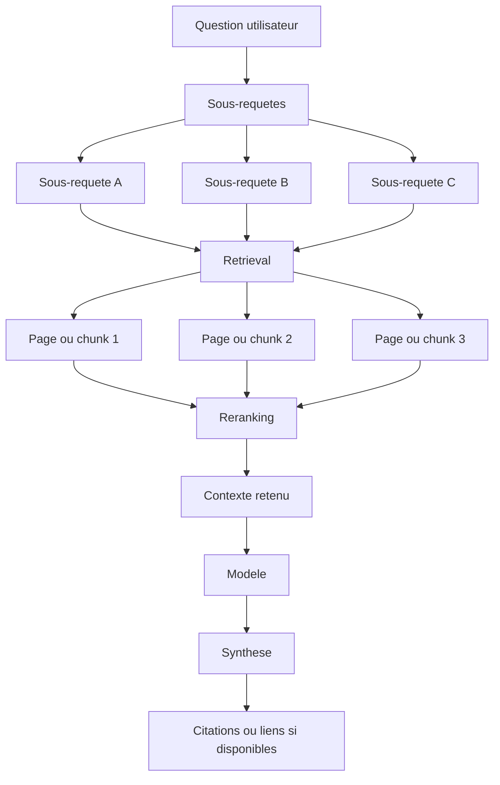

# Chapitre 7 · GEO : rendre ses contenus utiles aux moteurs génératifs

Dans les parties **précédentes** du parcours, on a surtout parlé d’**IA dans le travail**. Ici, on change d’angle : la question devient *"comment faire en sorte qu’un contenu public soit bien compris, bien résumé et, si possible, bien cité par des interfaces alimentées par l’IA ?"*

Le mot **GEO** revient souvent pour nommer cette préoccupation. Il signifie en général **Generative Engine Optimization**. L’idée est simple : le contenu ne doit plus seulement être trouvable ; il doit aussi être **compréhensible, extractible et réutilisable** dans des réponses générées.

Cette logique ne remplace pas le **SEO** : elle s’y ajoute. Elle ne vise pas non plus seulement les médias : documentation produit, pages service, FAQ, tarifs ou guides métier peuvent être concernés.

En une image : le **SEO** ouvre surtout la porte de la **découvrabilité** ; le **GEO** travaille ce qu’il y a derrière — un texte **assez clair** pour être **compris, reformulé et cité** quand l’utilisateur ne parcourt plus une simple liste de liens.

Si votre sujet porte plutôt sur un **assistant intégré dans votre produit**, ou sur un flux avec **API LLM** côté application, reprenez la partie **Produit IA & APIs** (**plus haut** dans le parcours). Ici, on reste sur la **visibilité et la qualité éditoriale** de contenus publics.

---

## 1. Ce que vous saurez faire après ce chapitre

À la fin de ces pages, vous devriez pouvoir :

1. **Expliquer simplement** ce qu’est le **GEO** et en quoi il complète le **SEO**.
2. **Repérer les contenus concernés** et les formats qui se reprennent bien.
3. **Comprendre le pipeline** le plus courant : sous-requêtes, récupération, extraction, synthèse, citation.
4. **Poser un petit plan d’action** pour améliorer un contenu existant sans tomber dans le gadget.

---

## 2. GEO : de quoi parle-t-on exactement ?

Le **GEO** désigne une manière de rédiger, structurer et publier un contenu pour qu’il soit plus facile à **interpréter correctement** par des moteurs génératifs ou des interfaces qui produisent des **synthèses avec sources**. Le sujet est à la fois **éditorial**, **produit** et **SEO**.

Quand un humain lit une page, il tolère mieux l’implicite. Un système génératif, lui, travaille souvent à partir de **fragments** : un titre, un sous-titre, un paragraphe, une liste, un tableau, quelques métadonnées. Si le sens principal est dispersé, vague ou contradictoire, la synthèse finale a plus de chances d’être mauvaise.

Le GEO ne consiste donc pas à "plaire à une IA". Il consiste à rendre un contenu **plus net, plus factuel et plus réutilisable**. Ce n’est ni un bouton secret, ni une garantie d’apparition. En revanche, vous pouvez agir sur quelque chose de concret : la **qualité extractible** de votre contenu.

Techniquement, beaucoup de systèmes suivent une logique assez proche, même si chaque acteur garde ses spécificités :

Schéma plus réaliste du pipeline :



En pratique, la question est souvent découpée en sous-questions, puis le système lance un **retrieval** (web, index privé, base doc). Il travaille surtout sur des **passages** de texte, les re-classe, envoie le contexte au modèle, puis affiche une synthèse avec ou sans citations selon la plateforme.

Beaucoup de systèmes de type **RAG** (*retrieval-augmented generation*) ne "lisent" pas une page comme un humain qui ferait défiler tout l’écran. Ils prennent des morceaux de texte, les injectent dans une fenêtre de contexte limitée, puis arbitrent. Cela favorise les blocs :

- courts ou au moins bien bornés ;
- autonomes sémantiquement ;
- riches en faits explicites ;
- reliés à des titres clairs ;
- peu dépendants d’un contexte implicite.

---

## 3. Pourquoi le GEO existe en plus du SEO

Le meilleur point de départ est de ne pas opposer les deux.

Le **SEO classique** cherche surtout à rendre une page **visible dans les résultats**. Le **GEO**, lui, devient important quand l’interface **résume**, **reformule**, **compare** ou **répond directement** à partir de plusieurs sources.

Le SEO répond plutôt à la question : *"est-ce que ma page peut être trouvée ?"* Le GEO ajoute : *"si elle est reprise par un assistant, restera-t-elle fidèle à ce qu’elle veut dire ?"*

Le lien entre les deux est très fort. Un mauvais SEO technique peut empêcher le reste d’exister : page introuvable, bloquée, lente, mal indexée, dupliquée, `noindex` accidentel. À l’inverse, un site techniquement propre mais rédigé avec des formulations creuses ou des promesses floues peut rester faible dans les interfaces génératives. Le SEO crée le **socle d’accès** ; le GEO travaille la **qualité de restitution** — la porte ouverte ne suffit pas si la pièce est vide ou floue.

---

## 4. Qui est concerné, concrètement ?

Le réflexe serait de croire que le GEO ne concerne que le marketing. Ce serait trop étroit.

Une **agence**, un **freelance**, un **cabinet**, un **éditeur SaaS**, un **site e-commerce**, une **boîte locale**, une **startup B2B**, un **média spécialisé**, ou une équipe qui maintient une **documentation produit** peut être concerné dès lors qu’une partie de sa visibilité passe par le web.

Le sujet est particulièrement fort pour les pages qui répondent déjà à une question, expliquent un choix, définissent un sujet ou rassurent sur un service. Les grandes familles les plus concernées sont souvent :

- les pages **service**, **expertise**, **locale** ou **cas d’usage** ;
- les pages **produit**, **fonctionnalité**, **catégorie**, **fiche produit** ou **tarifaire** ;
- les pages **FAQ**, **glossaire**, **définitions**, **guides pratiques** ou **tutoriels** ;
- les pages de **documentation**, **centre d’aide**, **base de connaissances** ou **docs API** ;
- les pages de **preuve** : **cas clients**, **réalisations**, **avis** ou **témoignages** ;
- les pages de **marque** et les contenus éditoriaux utiles : **À propos**, **équipe**, **articles**, **ressources**, **formations**.

Plusieurs profils ont donc intérêt à comprendre le sujet : le **SEO / acquisition**, la **rédaction**, le **support**, le **produit** et la **tech**. En une phrase : le GEO ne relève pas d’un seul métier.

---

## 5. Ce qui aide vraiment un contenu à bien "voyager"

Un contenu utile pour un moteur génératif n’est pas forcément un contenu long. Il est surtout **bien découpé** et **bien posé**.

Quatre qualités reviennent souvent :

1. **Des titres qui disent quelque chose.** Un intertitre vague comme *"Notre approche"* aide peu. Un intertitre du type *"À quoi sert un audit SEO local pour une petite entreprise ?"* aide beaucoup plus, parce qu’il annonce une intention lisible. Derrière ce titre, les deux ou trois premières phrases doivent répondre sans détour.
2. **Des sections autonomes.** Beaucoup de moteurs ou d’assistants récupèrent un bloc sans garder toute la page autour. Si une section ne tient debout qu’avec le paragraphe précédent, elle est plus fragile.
3. **Un vocabulaire cohérent.** Si vous parlez d’"audit", puis de "diagnostic", puis de "check-up", puis de "bilan" pour désigner la même chose sans raison, vous créez de l’ambiguïté inutile.
4. **Des faits vérifiables.** Une phrase comme *"nous intervenons sur Shopify, WooCommerce et Prestashop"* se reprend mieux qu’un flou du type *"nous travaillons avec les plus grandes solutions du marché"*. Encore mieux si la page apporte un élément de première main : un chiffre expliqué, une méthode claire, un retour terrain, ou une citation identifiable.

Les formats qui aident souvent le plus sont assez prévisibles : une **FAQ fondée sur de vraies questions**, un **guide pas à pas**, un **comparatif avec critères explicites**, une **page pilier** ou une **fiche tenue à jour** quand le sujet change vite. Rien de magique : ce sont simplement des formats qui résistent mieux à l’extraction et répondent plus facilement aux **sous-questions** générées en coulisses.

Vu côté expert, on peut résumer l’enjeu ainsi : un bon contenu GEO est **chunkable** et **fact-first**. Un paragraphe isolé doit rester compréhensible, avec peu d’ambiguïté, des **valeurs exactes** quand c’est utile, et une réponse placée tôt dans la section plutôt qu’en conclusion.

---

## 6. Le rôle du SEO dans tout cela

Le GEO sans SEO finit souvent en théorie.

Si vos pages sont mal crawlées, mal maillées, trop lentes, dupliquées, ou accidentellement exclues de l’indexation, elles auront déjà du mal à exister. Même un bon fond perd en lisibilité si son contenu principal est difficile à récupérer, à rendre ou à attribuer correctement.

C’est aussi là qu’entrent des points très concrets :

- ne pas bloquer inutilement des bots dans `robots.txt` ;
- vérifier aussi les directives `noindex`, `nofollow`, `nosnippet` et les en-têtes du type `X-Robots-Tag` ;
- éviter que l’information essentielle dépende d’un rendu JavaScript fragile ou d’un composant hydraté trop tard ;
- s’assurer que le contenu important existe bien dans le **HTML visible** et pas seulement derrière des onglets, accordéons, filtres, sliders ou logins ;
- surveiller les **logs serveur** ou le CDN pour voir si certains bots passent réellement.

Dans la vraie vie, le GEO s’appuie presque toujours sur un **SEO déjà propre**. Mais l’inverse est vrai aussi : du SEO sans angle GEO peut passer à côté d’un changement d’usage. Une page peut être bien positionnée tout en répondant mal aux requêtes conversationnelles.

L’idée simple à garder en tête : le SEO travaille la **découvrabilité**. Le GEO travaille la **citabilité** et la **reformulabilité**.

Il faut aussi accepter qu’il n’existe pas une seule "IA de recherche". **Google AI Overviews**, **Perplexity**, **ChatGPT Search**, **Gemini** ou **Claude** n’ont pas exactement les mêmes habitudes de citation, ni les mêmes biais sur la fraîcheur, la structure ou le poids des sources tierces.

En simplifiant, et avec prudence car ce sont surtout des tendances observées :

- **Google AI Overviews** reste souvent plus proche des signaux SEO classiques et de l’index Google ;
- **Perplexity** est généralement plus visible sur les citations explicites et assez sensible à la fraîcheur ;
- **ChatGPT Search** mélange plus fortement synthèse, recherche live et familiarité globale avec certaines sources ;
- **Claude** peut être plus synthétique et moins démonstratif sur les citations selon le contexte.

Le bon réflexe expert consiste donc à penser en **famille de systèmes**, pas en bloc unique.

Conséquence importante du **fan-out** : en GEO, vous n’êtes pas seulement en compétition sur une requête visible, mais sur un **ensemble de sous-requêtes invisibles** générées par la machine.

### 6.1. Exemple simple

Prenons une page de service. Pensée uniquement SEO, elle peut accumuler des mots-clés et des paragraphes génériques. Si un assistant doit ensuite la résumer à la question *"à quoi sert ce service et dans quels cas faut-il le prendre ?"* il risque de produire une réponse floue.

Une formule comme *"nous accompagnons votre transformation digitale avec une approche sur mesure"* se cite mal. Une formule comme *"nous concevons des sites vitrines, des boutiques en ligne et des automatisations simples pour PME, avec cadrage, design, développement et mise en ligne"* se reprend beaucoup mieux. Le SEO n’a pas disparu ; il est épaulé par une rédaction plus nette.

---

## 7. Quelques leviers très concrets

Pas besoin d’encyclopédie : quelques réflexes suffisent souvent.

### 7.1. Aligner les titres, le texte et le balisage

Même contenu en trois couches : **titre / intertitre**, **texte visible**, **schéma** (si présent). Pas de `FAQPage` ou de promesse de guide si l’écran ne montre pas la FAQ ou les étapes.

### 7.2. Rendre visibles les éléments de confiance

**Qui** parle, **quelle** marque, **quand** la page est à jour, **quelle** source fait foi — pour l’humain et pour les systèmes. Hors site : profils et mentions **cohérents** (réseaux, avis, annuaires, etc.). Une marque claire sur son site mais **floue** partout ailleurs reste fragile (**citation engineering** : signaux répétés et alignés).

### 7.3. Travailler les entités et les relations

**Entité** = chose identifiable (personne, marque, produit, lieu…). **Relation** = qui publie quoi, qui vend quoi. Le texte et le HTML donnent déjà des indices ; le **JSON-LD** `schema.org` **précise** sans remplacer le contenu.

À aligner : visible ↔ schéma ↔ ce que le site dit **ailleurs** sur la même entité.

**Schémas fréquents** : `Organization` / `LocalBusiness`, `Person`, `Article` / `BlogPosting`, `FAQPage` (si Q/R **à l’écran**), `HowTo` (si vraies étapes). Mêmes noms, URLs canoniques, pas de JSON-LD **trompeur**.

Le GEO poussé, c’est surtout clarifier **qui fait quoi** dans votre univers de marque — moins une course aux mots-clés qu’à des **entités stables**.

**Exemple : un article**

Si vous publiez un article de fond, le schéma minimal ressemble souvent à ceci :

```json
{
  "@context": "https://schema.org",
  "@type": "Article",
  "headline": "Comment vérifier si GPTBot est bloqué dans robots.txt",
  "datePublished": "2026-04-13",
  "dateModified": "2026-04-13",
  "author": {
    "@type": "Person",
    "name": "Tak Castel"
  },
  "publisher": {
    "@type": "Organization",
    "name": "Castel Agency"
  }
}
```

**Exemple : une FAQ**

Si la page affiche vraiment des questions-réponses visibles, vous pouvez ajouter un `FAQPage` :

```json
{
  "@context": "https://schema.org",
  "@type": "FAQPage",
  "mainEntity": [
    {
      "@type": "Question",
      "name": "Le GEO remplace-t-il le SEO ?",
      "acceptedAnswer": {
        "@type": "Answer",
        "text": "Non. Le GEO complète le SEO en cherchant à rendre le contenu plus facilement repris et cité dans des réponses génératives."
      }
    },
    {
      "@type": "Question",
      "name": "Pourquoi la fraîcheur du contenu compte-t-elle ?",
      "acceptedAnswer": {
        "@type": "Answer",
        "text": "Parce que beaucoup de systèmes génératifs privilégient des contenus récents, surtout sur les sujets techniques, produits ou réglementaires."
      }
    }
  ]
}
```

Règle essentielle : si ces questions et réponses ne sont **pas visibles** dans la page, le schéma devient trompeur.

**Exemple : un guide étape par étape**

Si la page explique une procédure, `HowTo` devient utile :

```json
{
  "@context": "https://schema.org",
  "@type": "HowTo",
  "name": "Vérifier si un bot IA est bloqué dans robots.txt",
  "step": [
    {
      "@type": "HowToStep",
      "name": "Ouvrir robots.txt",
      "text": "Accédez à votresite.com/robots.txt."
    },
    {
      "@type": "HowToStep",
      "name": "Chercher les user-agents IA",
      "text": "Vérifiez si GPTBot, ClaudeBot ou PerplexityBot sont mentionnés avec une directive Disallow."
    },
    {
      "@type": "HowToStep",
      "name": "Corriger si nécessaire",
      "text": "Supprimez les blocages inutiles si vous souhaitez que ces bots puissent accéder à vos pages publiques."
    }
  ]
}
```

**Comment on les ajoute vraiment**

En pratique, il y a trois cas fréquents :

1. **Dans le HTML** : vous ajoutez un bloc `<script type="application/ld+json">...</script>` dans la page.
2. **Dans un CMS ou un plugin SEO** : le plugin génère une partie du schéma pour vous, mais il faut vérifier qu’il correspond bien au contenu réel.
3. **Dans un framework** comme `Next.js` : vous injectez ce bloc côté serveur dans le rendu de la page ou du layout.

Exemple très simple en HTML :

```html
<head>
  <title>Comment vérifier si GPTBot est bloqué dans robots.txt</title>
  <script type="application/ld+json">
  {
    "@context": "https://schema.org",
    "@type": "Article",
    "headline": "Comment vérifier si GPTBot est bloqué dans robots.txt",
    "author": {
      "@type": "Person",
      "name": "Tak Castel"
    },
    "publisher": {
      "@type": "Organization",
      "name": "Castel Agency"
    }
  }
  </script>
</head>
```

Le plus important, techniquement, est moins "ajouter un gros JSON-LD" que respecter quelques règles :

- ne pas déclarer une `FAQPage` si la page n’affiche pas réellement une FAQ ;
- ne pas déclarer une `HowTo` s’il n’y a pas de vraies étapes ;
- garder les mêmes noms de marque, d’auteur et d’URLs partout ;
- vérifier le rendu avec des outils comme le test de résultats enrichis de Google ou `validator.schema.org` ;
- considérer le schéma comme un **complément** au HTML, pas comme un cache-misère pour un contenu flou.

### 7.4. Assumer la mise à jour et la vérification technique

Prix, loi, process, intégrations : ça **vieillit** — prévoir un minimum d’**entretien**.

**Checklist technique** : le contenu important est bien présent dans le **HTML** servi ; la hiérarchie des titres (`H1`, puis `H2`, puis `H3`) reste cohérente ; le schéma structuré colle à ce que l’utilisateur voit ; auteur, organisation et produit sont identifiables ; la date de mise à jour est à jour ; si besoin, des logs permettent de voir quels **bots** passent.

`llms.txt` existe en piste émergente ; ce n’est pas le levier **prioritaire** avant contenu visible, structure et accessibilité.

> **Attention**
>
> Une page très bien écrite mais factuellement fausse reste un mauvais signal pour les humains, pour le SEO et pour les environnements génératifs. Le style ne compense jamais le fond.

---

## 8. Ce qu’il ne faut pas attendre du GEO

Le GEO ne donne pas le contrôle sur ce qu’un modèle dira mot pour mot. Il augmente vos chances d’être repris correctement ; il n’offre pas de garantie.

Il ne faut pas non plus le traiter comme une excuse pour publier du **contenu vide**. Les pages conçues uniquement pour couvrir une requête, sans expérience réelle, sans preuve, sans angle clair et sans mise à jour, restent faibles.

Autre limite importante : la **mesure** est moins propre qu’en SEO classique. Vous pouvez observer le trafic, les requêtes longues, les recherches de marque, certains retours support, ou faire des tests qualitatifs avec des prompts types. Il faut aussi distinguer une **simple mention** d’une **vraie recommandation**.

Comme ces systèmes sont variables, un test isolé vaut peu. Côté expert, on préfère observer un **lot de requêtes**, parfois rejouées plusieurs fois, pour regarder :

- la **fréquence de citation** et la **part de voix** face aux concurrents ;
- la différence entre **mention**, **citation cliquable** et **recommandation** ;
- et, si possible, le trafic réellement envoyé par ces environnements.

Le vrai problème, aujourd’hui, est qu’il n’existe pas encore d’équivalent universel à une Search Console pour les moteurs génératifs. La mesure reste donc partielle, artisanale ou dépendante d’outils tiers.

S’il faut malgré tout retenir une idée forte, c’est celle-ci : en GEO, la métrique la plus proche d’un "classement" n’est pas une position stable, mais une **fréquence d’apparition**. Autrement dit : votre **share of voice IA**.

Il faut enfin accepter que les produits changent vite. D’où l’intérêt de raisonner en **principes robustes** plutôt qu’en tactiques à la mode.

---

## 9. Petit plan d’action raisonnable

Pour démarrer, inutile de refaire tout le site.

Commencez par identifier les **vraies questions** qui reviennent déjà dans votre activité : support, appels commerciaux, formulaire de contact, échanges clients, requêtes longues visibles dans vos outils SEO. Ce matériau vaut bien plus qu’un brainstorming abstrait.

Choisissez ensuite quelques pages prioritaires. Une page service importante, une page locale, une FAQ support, un guide de démarrage ou une documentation souvent consultée suffisent largement pour un premier cycle.

Retravaillez alors le contenu avec une discipline simple : un titre qui dit la question, une réponse nette au début, des sections autonomes, des termes cohérents, des exemples ou preuves quand c’est nécessaire, puis un contrôle de l’alignement entre contenu visible, maillage interne et balisage.

Ajoutez enfin un passage plus technique : vérifier que la page n’est pas bloquée pour les bots utiles, que le contenu clé est bien rendu côté HTML, que les schémas décrivent correctement l’auteur, l’organisation et le type de page, et que la page est suffisamment fraîche pour rester crédible.

Le bon niveau d’ambition au début n’est pas "dominer le GEO". C’est plutôt : **publier quelques pages plus nettes, plus utiles, plus faciles à résumer correctement**.

Il faut aussi assumer une conséquence du GEO : dans certains cas, être **cité sans clic** a tout de même de la valeur. Le trafic reste important, mais la visibilité de marque peut progresser même sans visite immédiate.

---

## 10. Erreurs fréquentes

On voit souvent :

- des pages qui veulent tout dire à la fois, sans hiérarchie claire ;
- des formulations très marketing, mais presque aucune réponse concrète ;
- des contenus qui répètent ce que tout le monde dit, sans preuve, sans source ou sans expérience propre ;
- des contenus techniquement difficiles à récupérer, parce que l’essentiel est caché derrière du JavaScript, des onglets, un login ou des blocs non visibles ;
- des signaux contradictoires entre le HTML visible, les métadonnées, le schéma et les profils de marque ;
- des tests GEO faits sur un seul prompt, puis interprétés comme une vérité stable ;
- des FAQ écrites pour remplir une section, pas pour aider ;
- des balisages ou des promesses qui ne collent pas au contenu visible.

Le piège le plus discret est peut-être celui-ci : croire qu’un texte "propre" suffit. Non. S’il reste vague, non sourcé, contradictoire ou daté, il sera mal exploité, même joliment.

---

## 11. Checklist de fin de chapitre

- [ ] Je peux expliquer en une phrase le lien entre **SEO** et **GEO**
- [ ] Je sais citer au moins **deux types de pages** de mon périmètre qui sont concernées par le GEO
- [ ] Je peux résumer le pipeline : **sous-requêtes -> récupération -> extraction -> synthèse -> citation**
- [ ] Je comprends pourquoi une section doit pouvoir être **comprise seule**
- [ ] Je sais pourquoi les **données structurées** doivent rester alignées avec le **contenu visible**
- [ ] Je connais au moins **deux** points techniques qui peuvent casser ma visibilité GEO (`robots.txt`, JS, login, `noindex`, etc.)
- [ ] J’ai identifié une page que je pourrais retravailler avec une logique **question -> réponse claire -> preuve**
- [ ] Je comprends qu’un bon GEO améliore des probabilités, pas une garantie d’apparition

---

## Mini-glossaire du chapitre 7

| Terme | Sens ici |
|-------|----------|
| **GEO** | Manière de rendre un contenu plus facile à **comprendre**, **résumer** et **citer** par des moteurs génératifs ou des interfaces de réponse. |
| **RAG** | *Retrieval-augmented generation* : le système va récupérer des documents ou extraits avant de générer sa réponse. |
| **Fan-out query** | Sous-requête dérivée d’une question plus large ; beaucoup de moteurs génératifs en produisent plusieurs au lieu de rechercher la question brute. |
| **Citation** | Cas où une interface renvoie explicitement vers votre **source** ou reprend votre information de façon identifiable. |
| **Entité** | Personne, marque, organisation, produit, lieu ou concept clairement identifiable et relié à d’autres éléments du web ou du schéma. |
| **Synthèse** | Réponse condensée construite à partir d’une ou plusieurs sources. |
| **Données structurées** | Balisage, souvent en **JSON-LD**, qui aide les moteurs à reconnaître le type d’une page et certains éléments de contexte. |
| **Zero-click** | Situation où l’utilisateur obtient déjà une partie de la réponse sans visiter votre page, ce qui augmente l’importance d’un contenu clair et exact. |

---

## À retenir en une phrase

Le **GEO** ne remplace pas le **SEO** : il pousse surtout à publier des contenus assez **clairs, fiables et structurés** pour être non seulement trouvés, mais aussi **bien repris** quand la recherche devient conversationnelle ou générative.

