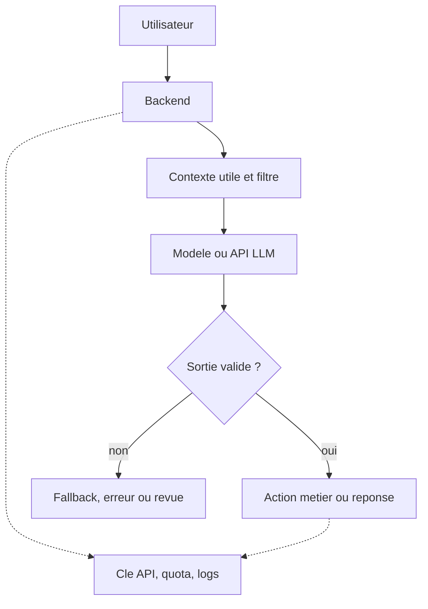

# Chapitre 9 · Synthèse du parcours

Ce chapitre recolle le fil rouge du parcours avant l’évaluation et les travaux pratiques. Idée clé : **l’IA accélère surtout quand le besoin est clair, les données sont maîtrisées, la sortie est relue et les décisions restent pilotées par l’équipe**.

---

## 1. Ce que vous saurez faire après ce chapitre

À la fin de ces pages, vous devriez pouvoir :

1. **Résumer le parcours** sans perdre le lien sécurité / méthode / produit / contenu.
2. **Expliquer l’ordre logique** : cadre, outils, méthode, intégration.
3. **Redire l’essentiel** sur LLM et RAG sans oublier droits, coûts et relecture.
4. **Décrire un schéma d’usage sérieux** : besoin clair, backend, données filtrées, sortie vérifiée.
5. **Repérer les erreurs classiques** avec assistants, agents et IA produit.

---

## 2. Le fil rouge du parcours

Le parcours suit une logique simple : commencer par le **cadre de travail**, puis les outils.

| Partie | Idée à retenir |
|--------|----------------|
| **Introduction** | L’IA est un **outil d’aide**, pas un substitut à la responsabilité humaine. |
| **Sécurité** | On ne colle pas des **secrets**, des **données sensibles** ou des bouts de production dans un chat « pour aller plus vite ». |
| **Assistants de code** | Un assistant dans l’IDE aide surtout si la tâche est **bornée**, le **diff relu** et les **tests** passés. |
| **Markdown & agents** | Une bonne session d’agent repose sur des **fichiers versionnés** et un contexte lisible, pas sur la mémoire d’un vieux chat. |
| **BMAD-METHOD** | Quand le sujet grandit, il faut faire circuler des **artefacts** et des **décisions relues**, pas seulement des prompts. |
| **Produit IA & APIs** | Dans un vrai produit, l’IA se branche via **votre backend**, avec validation, limites, coûts et observabilité. |
| **GEO** | Un contenu utile pour les moteurs génératifs est un contenu **clair**, **structuré**, **factuel** et **facile à citer**. |
| **Travaux pratiques** | La compréhension ne vaut vraiment que si elle se traduit dans **votre dépôt**, **vos docs** ou **votre produit**. |

L’ordre compte : sans sécurité, l’outil devient risqué ; sans méthode, la vitesse devient du bruit ; sans mesure, les coûts et fragilités montent ; sans pratique, on garde surtout des concepts. Le piège classique est **d’accélérer de mauvais process** et de produire plus vite de la dette.

---

## 3. Trois habitudes à garder partout

Ces trois réflexes reviennent dans presque tout le parcours.

| Habitude | Ce que cela veut dire en pratique |
|----------|-----------------------------------|
| **Clarifier** | Définir le **périmètre**, les **données autorisées**, le **format attendu** et la **définition de fini**. |
| **Vérifier** | Relire le **diff**, contrôler les **sources**, tester, et refuser les raccourcis trop beaux pour être vrais. |
| **Mesurer** | Suivre au moins un indicateur utile : **qualité**, **coût**, **latence**, **taux d’erreur**, **satisfaction** ou **temps gagné**. |

Beaucoup d’usages faibles échouent pour la même raison : on demande trop large, on valide par fatigue, et on ne mesure rien après coup.

---

## 4. LLM et RAG : rappel utile, sans tout redire

Un **LLM** reste probabiliste : utile pour générer, mais pas source de vérité métier ou juridique. En pratique, relisez les sorties, bornez le format (`JSON`, listes), n’envoyez pas tout le projet et gardez les faits dans vos bases, APIs et docs.

Le **RAG** ancre mieux les réponses sur un corpus, mais ne remplace ni les **droits d’accès**, ni le **filtrage des données sensibles**, ni le cadre contractuel. Les ACL et la sécurité se décident **avant** le prompt.

---

## 5. De l’IDE au produit : même logique, autre échelle

Les usages « dans l’IDE » et « dans le produit » ne sont pas deux mondes séparés : ce sont les **mêmes questions**, avec une surface de risque plus large côté produit.

| Question | Dans l’IDE | Dans le produit |
|----------|------------|-----------------|
| **Périmètre ?** | Une fonction, un bug, un composant, une story | Une feature, un flux utilisateur, une route API, un worker |
| **Quelles données ?** | Fichiers, sélection, logs, docs | Messages, docs, historique, données métier |
| **Qui valide ?** | La personne qui relit le diff | Produit / tech sur la sortie et les effets de bord |
| **Comment vérifier ?** | Diff, tests, lint, revue | Validation métier, logs, quotas, métriques, fallback |

---

## 6. Intégrer un modèle sans perdre le cadre

Le schéma minimal reste le suivant : l’utilisateur déclenche une action ; votre **backend** reçoit la requête ; votre code prépare un contexte **utile et filtré** ; un service appelle le modèle ; votre code **valide**, **journalise**, **borne** la sortie et décide quoi en faire.

**Mistral** ou un autre fournisseur ne change pas la méthode : la clé reste côté serveur ou dans un coffre, le choix du modèle reste un compromis qualité / coût / latence, et les **timeouts**, **retries**, plafonds et **logs** font partie du produit. Le détail d’**intégration produit** a été vu **plus haut** dans le parcours.

---

## 7. Ce que le parcours cherche à vous éviter

En condensé, les mauvaises habitudes reviennent souvent sous la même forme :

1. Tout coller dans le chat parce que « ce sera plus rapide ».
2. Demander trop large à un assistant ou à un agent, puis valider par fatigue.
3. Confondre réponse **fluide** et réponse **juste**.
4. Mettre la vérité métier **dans le modèle** au lieu de la garder dans des sources fiables.
5. Croire qu’un **RAG suffit** à rendre un système sûr ou exact.
6. Oublier **coûts**, **latence** et **maintenance** dès qu’une démo impressionne.
7. Publier des contenus **vagues** en espérant ensuite un bon traitement côté GEO.

Si vous gardez ces pièges en tête, vous avez déjà une bonne partie du parcours sous la main.

---

## 8. Une méthode minimale à réutiliser

Si vous ne deviez garder qu’une séquence, elle pourrait être celle-ci : formuler le besoin en une phrase claire ; définir le périmètre, les données autorisées et le résultat attendu ; choisir le bon niveau d’outil (chat, IDE, agent, workflow, API produit, simple doc à retravailler) ; produire une première sortie avec l’IA ; **relire** avec une grille adaptée (sécurité, exactitude, cas limites) ; **tester ou mesurer** ce qui peut l’être ; **documenter** ce qui devra être repris plus tard.

Le gain de temps n’est pas automatique : il apparaît surtout quand l’équipe a des **personnes capables de juger**, un minimum de **méthode** et des **docs utiles**.

---

## 9. Et maintenant ?

La suite dépend de votre rôle. Si vous êtes **apprenant**, reprenez les **travaux pratiques** ou la page **fin de parcours** (navigation en bas d’écran). Si vous êtes **développeur**, choisissez un cas réel dans votre dépôt et enchaînez : périmètre, assistant, diff, tests. Si vous êtes **PO / PM**, prenez une feature et vérifiez où vivent les **données**, les **critères d’acceptation** et les **risques**. Si vous travaillez sur le **contenu** ou la **visibilité**, rouvrez la partie **GEO** avec une page concrète à améliorer.

Le meilleur signe que le parcours vous a servi n’est pas de connaître tous les acronymes : c’est de mieux choisir **quand** utiliser l’IA, **sur quoi**, **avec quelles limites**, et **comment vérifier** ce qu’elle produit.

---

## Mini-glossaire du chapitre 9

| Terme | Sens ici |
|-------|----------|
| **LLM** | Modèle de langage qui génère du texte ou du code à partir d’une consigne et d’un contexte ; il reste **probabiliste** et borné. |
| **Token** | Unité comptée par le modèle ; sert aussi à mesurer la taille du contexte, le coût et parfois la latence. |
| **RAG** | Approche où l’on récupère d’abord des documents ou extraits pertinents, puis où l’on demande au modèle de répondre à partir de ces sources. |
| **Embedding** | Représentation vectorielle d’un texte, utilisée pour retrouver des passages proches du sens d’une requête. |
| **Chunk** | Morceau de texte découpé pour l’indexation ou la recherche documentaire. |
| **ACL** | Règles de droits d’accès : dans un RAG sérieux, elles se gèrent **avant** la génération, au moment du choix des sources. |
