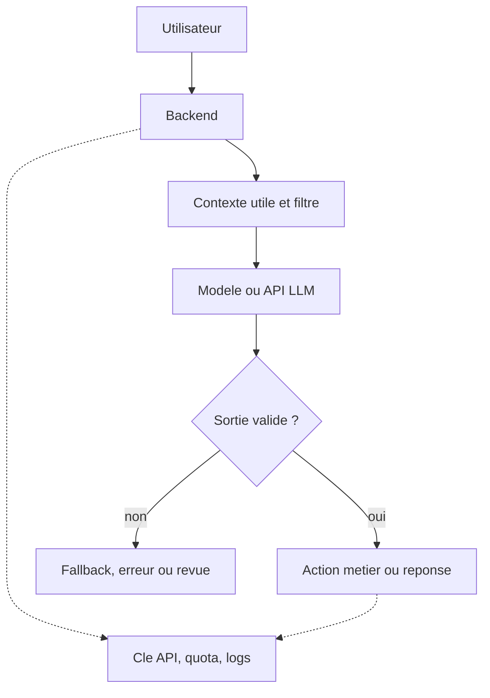

# Chapitre 9 · Synthèse du parcours

Ce chapitre recolle les idées des chapitres **1 à 8**. Il ne remplace pas les détails de chaque partie ; il sert à retenir le **fil rouge** du parcours avant de passer à l’évaluation, aux TP ou à une mise en pratique dans un vrai projet.

Si vous ne deviez garder qu’une idée, ce serait celle-ci : **l’IA accélère surtout quand le besoin est clair, les données sont maîtrisées, la sortie est relue, et le résultat reste branché sur un cadre produit ou technique solide**.

> **En bref**
>
> Le parcours ne vous demande ni de "croire" en l’IA, ni de la rejeter. Il vous apprend à l’utiliser comme un **outil rapide mais borné** : utile pour explorer, rédiger, coder, structurer ou intégrer, à condition de garder la main sur les **données**, la **qualité** et les **décisions**. L’enjeu n’est pas de remplacer les développeurs, mais de mieux structurer le travail avec les bons experts, les bonnes règles et les bons artefacts.

---

## 1. Ce que vous saurez faire après ce chapitre

À la fin de ces pages, vous devriez pouvoir :

1. **Résumer** le parcours en quelques idées simples, sans perdre le lien entre **sécurité**, **méthode**, **produit** et **contenu**.
2. **Expliquer** pourquoi l’ordre du parcours compte : d’abord le cadre, puis les outils, puis la méthode, puis l’intégration.
3. **Redire avec vos mots** ce qu’est un **LLM**, ce que change un **RAG**, et pourquoi cela ne dispense jamais de gérer les **droits**, les **coûts** et la **relecture**.
4. **Décrire** un schéma minimal d’usage sérieux : besoin clair, backend, données filtrées, sortie vérifiée, indicateurs suivis.
5. **Identifier** les erreurs typiques qu’on cherche à éviter en travaillant avec des assistants, des agents ou des fonctionnalités IA dans un produit.

---

## 2. Le fil rouge des chapitres 1 à 8

Le parcours suit une logique volontaire : il ne commence pas par "quel bouton cliquer", mais par **dans quel cadre travailler**.

| Chapitre | Idée à retenir |
|----------|----------------|
| **1 · Introduction** | L’IA est un **outil d’aide**, pas un remplacement de la responsabilité humaine. |
| **2 · Sécurité** | On ne colle pas des **secrets**, des **données sensibles** ou des bouts de production dans un chat "pour aller plus vite". |
| **3 · Assistants de code** | Un assistant dans l’IDE aide surtout si la tâche est **bornée**, le **diff relu** et les **tests** passés. |
| **4 · Markdown & agents** | Une bonne session d’agent repose sur des **fichiers versionnés** et un contexte lisible, pas sur la mémoire floue d’un vieux chat. |
| **5 · BMAD-METHOD** | Quand le sujet grandit, il faut faire circuler des **artefacts** et des **décisions relues**, pas seulement des prompts. |
| **6 · Produit IA & APIs** | Dans un vrai produit, l’IA se branche via **votre backend**, avec validation, limites, coûts et observabilité. |
| **7 · GEO** | Un contenu utile pour les moteurs génératifs est un contenu **clair**, **structuré**, **factuel** et **facile à citer**. |
| **8 · Travaux pratiques** | La compréhension ne vaut vraiment que si elle se traduit dans **votre dépôt**, **vos docs** ou **votre produit**. |

L’ordre est important.

Si vous sautez la sécurité, l’outil devient dangereux. Si vous sautez la méthode, le gain de vitesse se transforme en bruit. Si vous sautez le produit et la mesure, une idée séduisante devient vite une feature coûteuse ou fragile. Si vous sautez la pratique, vous gardez surtout des mots.

Pour une agence ou une équipe qui veut "mettre de l’IA partout", le risque est souvent là : **accélérer les mauvais process**. Si l’équipe n’a pas l’habitude de cadrer, de documenter le code, de versionner ses décisions ou de travailler avec un minimum de méthode agile, elle peut surtout produire plus vite de la confusion, de la dette technique et des intégrations fragiles. Un code mal documenté reste une dette ; avec l’IA, cette dette peut même se répéter plus vite.

---

## 3. Trois habitudes à garder partout

Ces trois réflexes traversent presque tout le parcours.

| Habitude | Ce que cela veut dire en pratique |
|----------|-----------------------------------|
| **Clarifier** | Définir le **périmètre**, les **données autorisées**, le **format attendu** et la **définition de fini**. |
| **Vérifier** | Relire le **diff**, contrôler les **sources**, tester le comportement, et refuser les raccourcis trop beaux pour être vrais. |
| **Mesurer** | Suivre au moins un indicateur utile : **qualité**, **coût**, **latence**, **taux d’erreur**, **satisfaction** ou **temps gagné**. |

Ces trois habitudes valent aussi bien pour un prompt dans un IDE que pour une feature IA exposée à des clients.

> **En bref**
>
> Beaucoup d’usages faibles de l’IA échouent pour la même raison : on demande trop large, on accepte trop vite, et on ne mesure rien après.

---

## 4. Ce qu’un LLM fait vraiment, et ce qu’il ne fait pas

Un **LLM** (*Large Language Model*, grand modèle de langage) génère du texte à partir d’un **contexte** et d’une **consigne**. Il ne "comprend" pas votre entreprise, votre code ou votre métier comme un collègue humain. Il calcule des suites probables de **tokens** dans une **fenêtre de contexte** bornée.

Cela entraîne quelques conséquences simples :

- il peut produire quelque chose de **convaincant mais faux** ;
- il ne garde pas de mémoire fiable de votre projet sans **contexte fourni** ;
- il coûte plus cher et répond plus lentement si vous envoyez **trop** de texte ;
- il n’est pas une **source de vérité** métier, juridique ou technique.

Dans le parcours, cette idée n’est pas là pour "faire de la théorie". Elle sert à justifier des habitudes très concrètes :

- relire le code généré ;
- demander des sorties plus **bornées** quand c’est utile (`JSON`, listes fermées, critères visibles) ;
- éviter de coller "tout le projet" ou "tout l’historique" dans un prompt ;
- garder les faits réels dans vos **bases**, vos **APIs**, vos **docs** et vos **règles métier**.

---

## 5. RAG : utile, mais pas magique

Le **RAG** (*retrieval-augmented generation*) consiste à aller chercher des passages pertinents dans un corpus, puis à les donner au modèle avant la génération de la réponse. L’idée n’est pas de rendre le modèle "omniscient". L’idée est de l’ancrer sur des **sources choisies**.

Bien utilisé, le RAG aide à :

- répondre sur une **documentation** ou une **base de connaissances** ;
- réduire une partie des réponses inventées ;
- renvoyer vers des **sources** ou des extraits concrets ;
- mettre à jour la connaissance sans réentraîner un modèle.

Mais le RAG ne règle pas les vrais problèmes à votre place.

- Il ne remplace pas les **droits d’accès**.
- Il ne dispense pas de filtrer les **données sensibles**.
- Il n’autorise pas à envoyer toute la **doc interne** vers un service tiers sans vérifier le cadre.
- Il ne transforme pas automatiquement un contenu confus en bonne réponse.

Le bon réflexe, déjà vu dans les chapitres [2 : Sécurité](02-securite-ia.md) et [6 : Produit IA & APIs](06-produit-ia-apis.md), reste le même : **les ACL et la sécurité se gèrent avant le prompt, au niveau de la récupération et des sources exposées au système**.

---

## 6. De l’assistant de code au produit : même logique, autre échelle

Un point important du parcours est que les usages "dans l’IDE" et les usages "dans le produit" ne sont pas deux mondes séparés. Ils reposent sur les mêmes questions, mais à des échelles différentes.

| Même question | Dans l’IDE | Dans le produit |
|---------------|------------|-----------------|
| **Quel est le périmètre ?** | Une fonction, un bug, un composant, une story | Une feature, un flux utilisateur, une route API, un worker |
| **Quelles données partent ?** | Fichier courant, sélection, logs, docs | Messages utilisateur, docs, historique, données métier |
| **Qui valide ?** | Le développeur ou la développeuse qui relit le diff | L’équipe produit / tech qui contrôle la sortie et les effets |
| **Comment vérifier ?** | Diff, tests, lint, revue | Validation métier, logs, quotas, métriques, fallback |

Autrement dit : on ne change pas de philosophie. On change surtout de **surface de risque**.

Dans l’IDE, l’erreur classique est de laisser un agent partir trop large ou d’accepter un diff mal relu. Dans le produit, l’erreur classique est de brancher un modèle trop vite sans limites, sans observabilité, ou sans politique claire sur les données. Dans les deux cas, le rôle des développeurs ne disparaît pas : il devient encore plus important sur le cadrage, la relecture, la documentation et l’architecture.

---

## 7. Intégrer un modèle dans un produit sans perdre le cadre

Le schéma minimal à retenir est simple :

1. l’utilisateur déclenche une action ;
2. votre **backend** reçoit la requête ;
3. votre code prépare un contexte **utile et filtré** ;
4. votre service appelle un modèle ;
5. votre code **valide**, **journalise**, **borne** et décide quoi faire de la sortie.

Schéma simplifié :

Cette logique vaut quel que soit le fournisseur.

Si vous utilisez **Mistral** comme exemple concret, l’idée n’est pas de changer la méthode du parcours. C’est simplement un cas de plus dans la famille des APIs LLM :

- la **clé API** reste côté serveur ou dans un coffre ;
- le choix du **modèle** dépend du compromis qualité / coût / latence ;
- la sortie peut être du texte libre ou un format plus **contraint** ;
- les **timeouts**, **retries**, **plafonds de tokens** et **logs utiles** font partie du produit, pas du "bonus".

Le vrai point de la synthèse est donc celui-ci : **Mistral n’est pas la méthode ; c’est un exemple de fournisseur à brancher dans la méthode déjà posée au chapitre 6**.

---

## 8. Ce que le parcours essaie de vous éviter

Au fond, tout le parcours lutte contre quelques mauvaises habitudes récurrentes :

1. **Tout coller dans le chat** parce que "ce sera plus rapide".
2. **Demander trop large** à un assistant ou à un agent, puis valider par fatigue.
3. **Confondre réponse fluide et réponse juste**.
4. **Mettre la vérité métier dans le modèle** au lieu de la garder dans des sources fiables.
5. **Croire qu’un RAG suffit** à rendre un système sûr ou exact.
6. **Oublier les coûts, la latence ou la maintenance** dès qu’une démo semble impressionnante.
7. **Publier des contenus vagues** alors qu’on attend ensuite qu’un moteur génératif les comprenne bien.

Si vous gardez ces pièges en tête, vous avez déjà retenu une grande partie du parcours.

---

## 9. Une méthode minimale à réutiliser

Si vous deviez garder une seule séquence de travail, elle pourrait ressembler à ceci :

1. **Formuler** le besoin en une phrase claire.
2. **Définir** le périmètre, les données autorisées et le résultat attendu.
3. **Choisir** le bon niveau d’outil : chat, assistant de code, agent, workflow, API produit, ou simple doc à réécrire.
4. **Produire** une première sortie avec l’IA.
5. **Relire** le résultat avec une grille adaptée : sécurité, exactitude, cas limites, cohérence locale.
6. **Tester ou mesurer** ce qui peut l’être.
7. **Documenter** ce qui devra être relu ou repris plus tard.

Cette séquence fonctionne pour une petite question dans l’IDE, pour une story cadrée avec des agents, pour une intégration API dans un produit, et même pour une page web retravaillée avec un angle GEO.

Le gain de temps existe vraiment, mais il n’est pas automatique. Il apparaît surtout quand l’équipe a déjà des **experts capables de juger**, un minimum de **méthode**, des **docs utiles** et des habitudes saines de revue. Sans cela, l’IA risque moins de "remplacer" le travail que de répéter plus vite ses défauts.

---

## 10. Et maintenant ?

Après cette synthèse, la suite logique dépend de votre contexte :

- si vous êtes **apprenant**, revenez aux [travaux pratiques du chapitre 8](08-travaux-pratiques.md) ou passez au [chapitre 10 : Fin de parcours](10-evaluation.md) ;
- si vous êtes **développeur**, reprenez un cas réel de votre dépôt avec la boucle : périmètre → assistant → diff → tests ;
- si vous êtes **PO / PM**, reprenez une feature et vérifiez où vivent les **données**, les **critères d’acceptation** et les **risques** ;
- si vous travaillez sur le **contenu** ou la **visibilité**, revenez au [chapitre 7 : GEO](07-geo.md) avec une page réelle à améliorer.

> **En bref**
>
> Le meilleur signe que le parcours vous a servi n’est pas de connaître tous les acronymes. C’est de mieux choisir **quand** utiliser l’IA, **sur quoi**, **avec quelles limites**, et **comment vérifier** ce qu’elle produit. Le vrai progrès n’est pas de remplacer les experts ; c’est de mieux outiller une équipe déjà capable de travailler proprement.

---

## Mini-glossaire du chapitre 9

| Terme | Sens ici |
|-------|----------|
| **LLM** | Modèle de langage qui génère du texte ou du code à partir d’une consigne et d’un contexte ; il reste **probabiliste** et borné. |
| **Token** | Unité de texte manipulée par le modèle ; elle sert aussi à mesurer la **taille du contexte**, le **coût** et parfois la **latence**. |
| **RAG** | Approche où l’on récupère d’abord des documents ou extraits pertinents, puis où l’on demande au modèle de répondre à partir de ces sources. |
| **Embedding** | Représentation vectorielle d’un texte utilisée pour retrouver des passages proches du sens d’une requête. |
| **Chunk** | Morceau de texte découpé pour l’indexation ou la recherche documentaire. |
| **ACL** | Règles de droits d’accès : dans un RAG sérieux, elles se gèrent **avant** la génération, au moment où l’on choisit les sources accessibles. |

